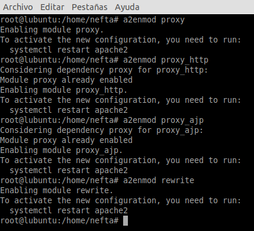
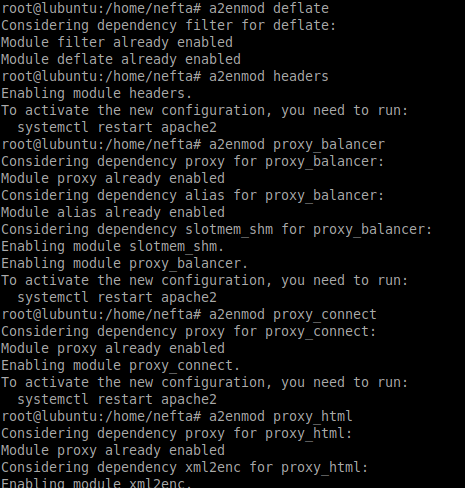
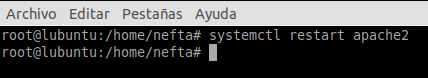
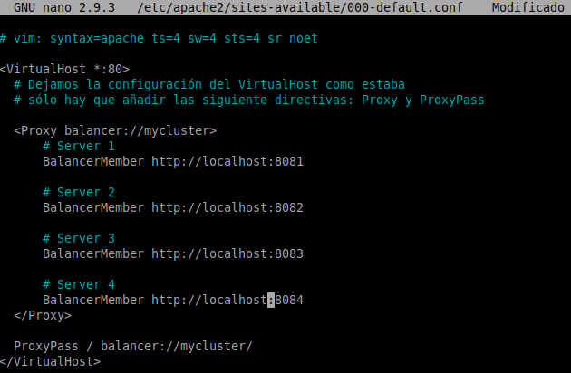
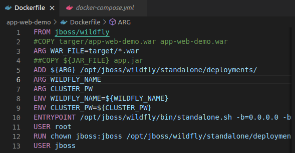
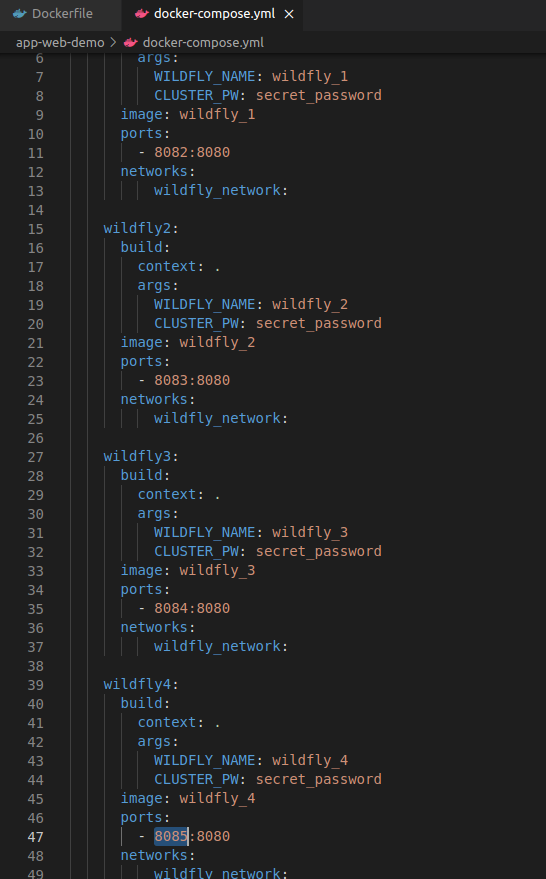
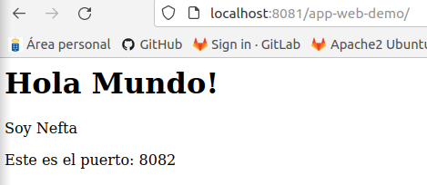
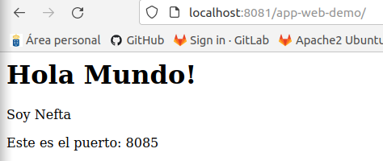
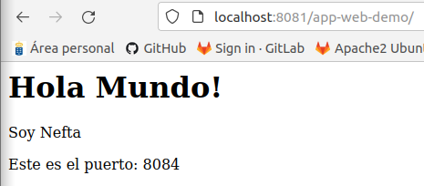

## **Balanceo de Carga con Apache**

**Neftalí Rodríguez Rodríguez**

[**Github**](https://github.com/InKu3uS/)

**Indice**

[Balanceo de Carga con Apache](#id1)

[1. Primera parte](#id1)

[2. Segunda parte](#id2)

[3. Tercera parte](#id3)

[4. Cuarta parte](#id4)

[5. Quinta parte](#id5)

[6. Sexta parte](#id6)

[7. Septima parte](#id7)

## **1. Primera parte**

Activamos los nodos necesarios para hacer balanceo de carga en Apache

## **2. Segunda parte**

Despues de activar todos los modulos necesarios, reiniciamos el servicio de Apache2

## **3. Tercera parte**

Editamos /etc/apache2/sites-available/000-default.conf y añadimos las siguientes lineas al archivo

## **4. Cuarta parte**

Creamos el archivo **Dockerfile** en el directorio raiz del proyecto con el contenido que aparece en la imagen.

## **5. Quinta parte**

Por ultimo creamos el archivo **“docker-compose.yml”** con 4 contenedores de **Wildfly** en los que se desplegará la app

## **6. Sexta parte**

Por último ejecutamos **“docker-compose up -d”** y esperamos a que se desplieguen los 4 contenedores

## **7. Septima parte**

Por último, abrimos el navegador e introducimos en la URL **“localhost:8081/app-web-demo/”** y comprobamos que funciona

