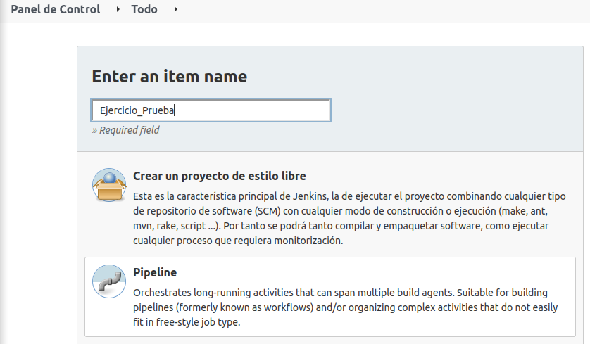
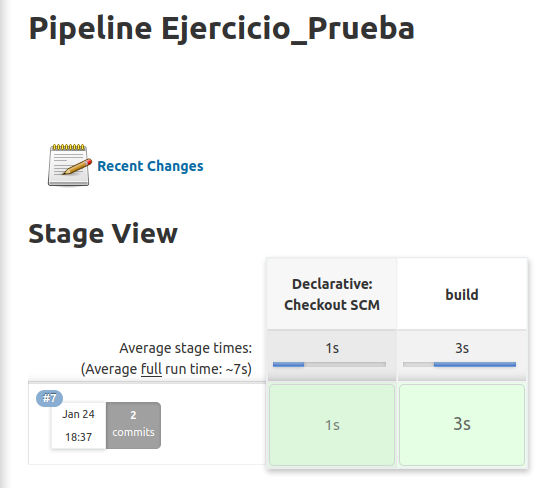

## **Creación de un Pipeline en Jenkins en PHP y Apache**

**Neftalí Rodríguez Rodríguez**

[**Github**](https://github.com/InKu3uS/)

Indice

[Creación de un Pipeline en Jenkins en PHP y Apache	1](#id1)

[1. Parte 1](#id1)

[2. Parte 2](#id2)

[3. Parte 3](#id3)

[4. Parte 4](#id4)

[5. Parte 5](#id5)

## **1. Parte 1**

Creamos un nuevo repositorio en **GitHub** con el nombre **“hello-world-php-apache”**

## **2. Parte 2**

Clonamos el repositorio en nuestra maquina local. Dentro del directorio principal creamos el directorio **“src”** y dentro creamos un archivo **PHP** como el siguiente.

## **3. Parte 3**

En la raiz del directorio del repositorio creamos un archivo **Dockerfile** con el siguiente contenido

Posteriormente creamos el archivo **Jenkinsfile** que le indicará a **Jenkins** las fases y los pasos a seguir.

## **4. Parte 4**

El siguiente paso será dirigirnos a **Jenkins** y crear una nueva tarea **Pipeline**

En lugar de introducir el script directamente pulsamos sobre **“Pipeline script from SCM”**, luego configuramos el repositorio en el que se buscará el archivo **Jenkinsfile** y el nombre de usuario y contraseña para acceder a **GitHub**

## **5. Parte 5**

Una vez se haya creado la tarea, probamos a ejecutarla. Si todo va bien deberíamos ver una pantalla como la siguiente.

Comprobamos el **log** del **Pipeline** para comprobar que todo ha salido correctamente.

Por último, accedemos a la dirección **“localhost:8085”** y comprobamos que vemos el contenido del archivo **“index.php”** que creamos.

