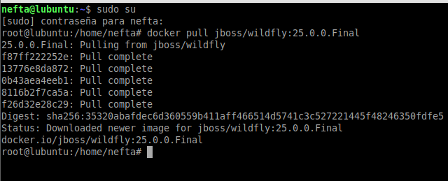
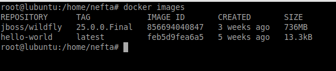
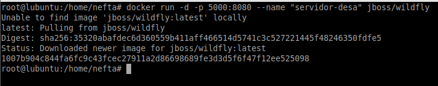
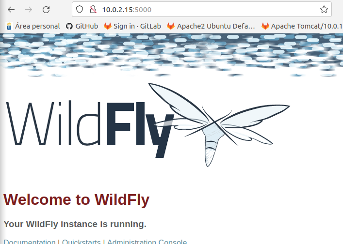

## **Ejercicio Practico**

**Neftalí Rodríguez Rodríguez**

[**Github**](https://github.com/InKu3uS/)

**Indice**

[Ejercicio Practico](#id1)

[1. Primera parte](#id1)

[2. Segunda parte](#id2)

[3. Tercera parte](#id3)

[4. Cuarta parte](#id4)

## **1. Primera parte**
Para descargar el Docker de **Wildfly** escribiremos el siguiente comando en la terminal

**“sudo docker pull jboss/wildfly:25.0.0.Final”** y esperamos a que se complete la descarga.

## **2. Segunda parte**

Comprobamos que la imagen de **Wildfly** se encuentra en la lista de imágenes de Docker mediante **“docker images”**

## **3. Tercera parte**

Para arrancar el contenedor usaremos el comando **“sudo docker run -d -p 5000:8080 --name "servidor-desa" jboss/wildfly”**. **-d** nos sirve para arrancarlo como daemon, **-p 5000:8080** redirecciona el puerto 5000 de la maquina a la 8080 del contenedor Wildfly, **--name** define un alias al contenedor

## **4. Cuarta parte**

Por ultimo accederemos al contenedor mediante el navegador introduciendo la IP de la maquina y el puerto 5000.

