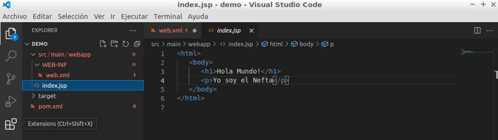

## **Despliegue App Hola Mundo**

**Neftalí Rodríguez Rodríguez**

[**Github**](https://github.com/InKu3uS/)

**"Indice**

[1. Primera parte	2](#id1)

[2. Segunda parte	3](#id1)

[3. Tercera parte	4](#id1)

[4. Cuarta parte	5](#id1)

[5. Quinta parte	6](#id1)

[6. Sexta parte	7](#id1)

[7. Septima parte	7](#id1)

[8. Octava parte	8](#id1)

[9. Novena parte	9](#id1)

[10. Decima parte   9](#id10)

## **1. Primera parte**

Creamos un nuevo proyecto Maven en VSCode.

Pulsamos **CTRL+MAYUS+P** y pulsamos en **Create Java Project**

## **2. Segunda parte**

Pulsamos en **Maven from archetype**

## **3. Tercera parte**

Por ultimo en **maven-archetype-webapp**

## **4. Cuarta parte**

Y le ponemos un nombre al proyecto, en nuestro caso será **“demo”**

## **5. Quinta parte**

El resto de opciones las dejaremos por defecto ya que se trata de un proyecto de prueba y no nos haran falta.

Esperamos a que Maven termine de crear el proyecto, nos aparecerá una pantalla siguiente.

## **6. Sexta parte**

Creamos el siguiente archivo **web.xml** que aparece en la imagen.

## **7. Septima parte**
Modificamos el **index.jsp** y colocamos el mensaje que queramos que se muestre al inicio

## **8. Octava parte**

Ejecutamos **mvn clean install** desde la terminal de VSCode para compilar la App

En la carpeta target del proyecto veremos que ha aparecido el paquete en formato WAR con el nombre del proyecto.

## **9. Novena parte**

Lo siguiente que haremos será copiar el archivo WAR al directorio ***opt*/tomcat/apache-tomcat/webapps**

## **10. Decima parte**

Por último, accederemos desde el navegador para comprobar que la app se ha desplegado correctamente.

