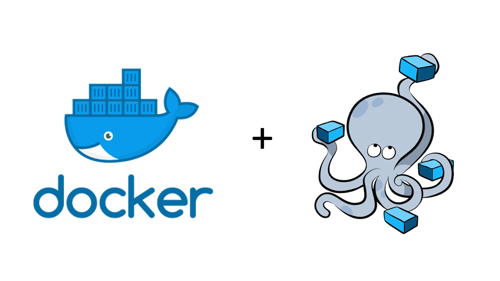
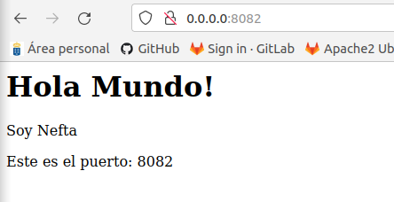

## **Cluster de Wildfly con Docker**

**Neftalí Rodríguez Rodríguez**

[**Github**](https://github.com/InKu3uS/)

**Indice**

[Cluster de Wildfly con Docker](#id1)

[1. Primera parte](#id1)

[2. Segunda parte](#id2)

[3. Tercera parte](#id3)

[4. Cuarta parte](#id4)

## **1. Primera parte**

Lo primero que haremos será instalar **Docker Compose** en nuestra maquina mediante el comando **“apt install docker-compose”**

En nuestro caso, hemos instalado la version **1.17.1**

## **2. Segunda parte**

Nos descargamos el proyecto **“app-web-demo”** y lo cargamos en **VSCode**. Una vez hayamos hecho la modificacion en el **“index.jsp”** abrimos una consola en la raiz del proyecto y ejecutamos **“mvn clean install”**.

Cuando termine el proceso, ejecutamos en la terminal **“mvn jetty run”**, luego abrimos el navegador y accedemos a la URL **“0.0.0.0:8082”**. Debemos ver una pantalla como la de la imagen.

## **3. Tercera parte**

Una vez hayamos probado mediante Jetty que la app funciona correctamente la desplegaremos en dos contenedores **Docker** con **Wildfly** mediante el comando **“docker compose up -d”**. Al final, deberemos ver una salida de terminal como la que se muestra a continuación.

## **4. Cuarta parte**

Por último, solo nos queda probar que la app se ha desplegado en ambos contenedores con éxito. Para ello accederemos nuevamente al navegador mediante la URL **“localhost:8080/app-web-demo/”**. **8080** es el puerto que usa el primer contenedor.

Probamos tambien con el puerto **8081** que es el que escucha el segundo contenedor

