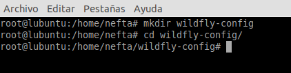
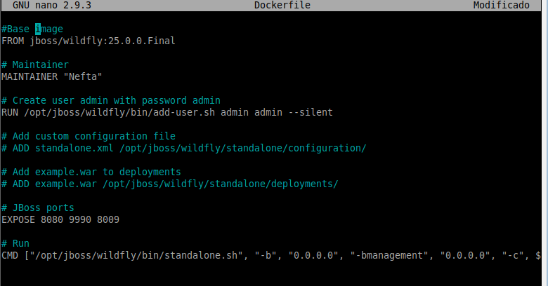
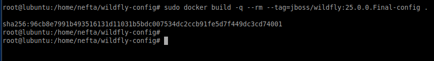
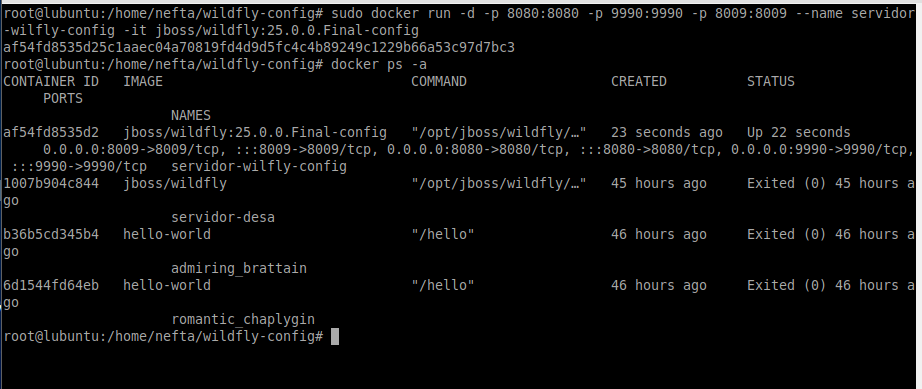
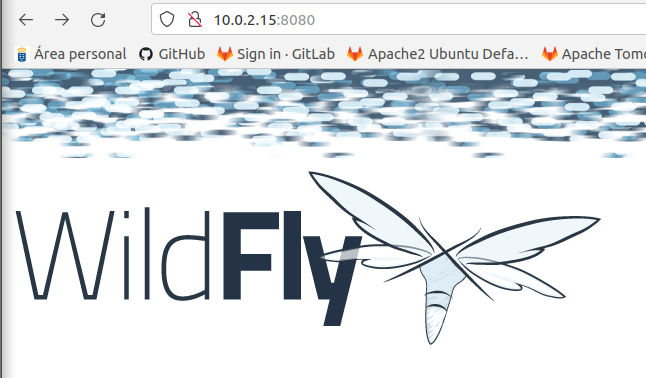
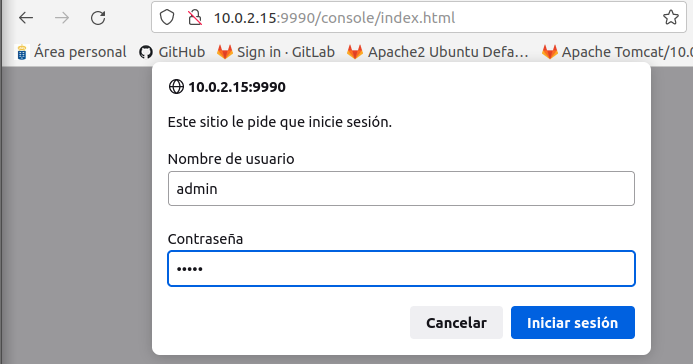
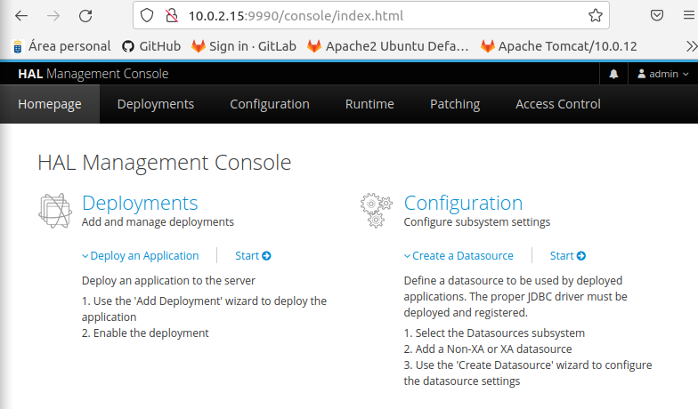

## **Ejercicio Practico**

**Neftalí Rodríguez Rodríguez**

[**Github**](https://github.com/InKu3uS/)

**Indice**

[Ejercicio Practico](#id1)

[1. Primera parte](#id1)

[2. Segunda parte](#id2)

[3. Tercera parte](#id3)

[4. Cuarta parte](#id4)

[5. Quinta parte](#id5)

## **1. Primera parte**

Crearemos un directorio con el nombre **“wildfly-config”** y accederemos a este.

Dentro del nuevo directorio creamos el archivo **“Dockerfile”** y añadimos el contenido que se ve en la siguiente imagen.

## **2. Segunda parte**

Construimos la imagen. Con el atributo **“--tag=”** le pondremos un nombre.

## **3. Tercera parte**

Verificamos todas las imagenes de docker que tenemos en nuestro equipo y comprobamos que aparece la última imagen que acabamos de crear.

## **4. Cuarta parte**

A continuación, ejecutamos la imagen .

Accedemos desde el navegador a **Wildfly** a través del puerto **8080** que es el que especificamos en la imagen anterior al ejecutar la imagen.

Accedemos a la consola de administración, nos pedirá el usuario y contraseña. Introducimos **“admin-admin”** que es el usuario que especificamos en el archivo **“Dockerfile”**

Como se puede observar en la siguiente imagen, mediante dicho usuario tenemos acceso a la consola de administración de **Wildfly**

