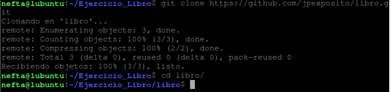
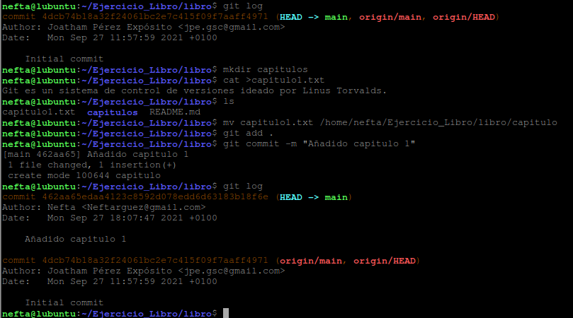

## **Ejercicio Libro**

**Neftalí Rodríguez Rodríguez**

**Indice**

[1. Pasos previos](#id1)

[2. Ejercicio 1](#id2)

[3. Ejercicio 2](#id3)

[4. Ejercicio 3](#id4)

[5. Ejercicio 4](#id5)

[6. Ejercicio 5](#id6)

[7. Ejercicio 6](#id7)

[8. Ejercicio 7](#id8)

[9. Ejercicio 8](#id9)

[9. Ejercicio 9](#id10)

## **1. Pasos previos**

Creamos un directorio para realizar el ejercicio y dentro de este clonaremos el repositorio mediante el comando: **git clone https://github.com/jpexposito/libro.git**

Una vez hecho accedemos al nuevo directorio.

##

## **2. Ejercicio 1**

Mostramos el historial de cambios del repositorio con **git log**

luego creamos un nuevo directorio llamado **capitulos**, y dentro de este un archivo con el nombre **capitulo1.txt** con el contenido que se ve en la imagen.

Añadimos los cambios a la zona de intercambio temporal con **git add .** Y luego realizamos un commit con el comando **git commit -m “Añadido capitulo 1”**

Volvemos a revisar el historial y veremos que aparece el commit que acabamos de realizar.

##

## **3. Ejercicio 2**

Creamos el archivo capitulo2.txt dentro del directorio capítulos con el contenido que aparece en la imagen siguiente.

Añadimos los cambios a la zona de intercambio temporal con **git add .**

Realizamos un nuevo commit con **git commit -m “Añadido capitulo 2”**

Por ultimo mostramos las diferencias entre esta version y dos versiones anteriores mediante el comando **git diff HEAD~2..HEAD**

##

##
##

## **4. Ejercicio 3**

Creamos un nuevo archivo dentro del directorio **capitulos** llamado **capitulo3.txt** con el texto que aparece en la imagen.

Añadimos los cambios a la zona de intercambio temporal con **git add .**

Realizamos un nuevo commit con **git commit -m “Añadido capitulo 3”**

Mosramos las diferencias entre la primera y la última versión del repositorio con el comando

git diff <codigo hash de la primera version>..HEAD

## **5. Ejercicio 4**

Creamos el archivo **indice.txt** en la raiz del repositorio con el contenido que se ve en la siguiente imagen.

Se añaden los cambios a la zona de intercambio temporal con **git add .**

Hacemos un commit **git commit -m "Añadido el índice ."**

Usamos el comando **git annotate indice.txt** para ver quien ha hecho los ultimos cambios en el archivo indice.txt

## **6. Ejercicio 5**

Lo siguiente que haremos será crear una nueva rama llamada bibliografia con **git branch bibliografia** y luego mostraremos las ramas del repositorio con **git branch -av**

## **7. Ejercicio 6**

Creamos el archivo **capitulo4.txt** con el contenido que se aprecia en la imagen.

Añadimos los cambios a la zona de intercambio temporal con **git add .**

Hacemos un commit **git commit -m "Añadido el capitulo 4 ."**

Mostramos la historia del repositorio incluyendo todas la ramas que se han creado con **git log –graph –all --oneline**

## **8.** **Ejercicio 7**

Creamos la rama **bibliografia** con el comando **git branch bibliografia** y nos movemos a ella.

Creamos el archivo **bibliografia.txt** con el contenido que aparece en la imagen.

Añadimos los cambios a la zona de intercambio temporal con **git add .**

Realizamos el commit **con git commit – m “mensaje de commit”**

Por último, mostramos la historia del repositorio con el comando **git log –graph –all – oneline**

## **9. Ejercicio 8**

Nos movemos a la rama main con **git checkout main**

Fusionamos la rama main con la rama bibliografia con **git merge bibliografia**

Mostramos la historia del repositorio con el comando **git log –graph –all – oneline**

Luego, eliminamos la rama bibliografia con el comando **git branch -d bibliografia**.

Volvemos a mostrar la historia del repositorio para comprobar que la rama bibliografia se ha eliminado.

## **10. Ejercicio 9**

Creamos nuevamente la rama bibliografia con **git branch bibliografia** y nos movemos a ella con **git checkout bibliografia**

Modifocamos el archivo **bibliografia.txt** para que contenga lo que aparece en la imagen

Volvemos a la rama main mediante **git checkout main**

Desde esta rama modificamos nuevamente el archivo **bibliografia.txt** con el contenido de la imagen.

Realizamos el commit con **git commit -m “mensaje del commit”**

Intentamos fusionar la rama bibliografia con la main mediante **git merge bibliografia** y veremos que nos aparecerá un conflicto ya que en las dos ramas, bibliografia contiene elementos diferentes.

Si abrimos **bibliografia.txt** con un editor de texto (en este caso nano) veremos que git nos ha indicado con **“HEAD”** el contenido que tenemos en la rama main y a continuacion lo que contiene la rama bibliografia.

Realizamos los cambios que aparecen en la imagen para resolver el conflicto

Una vez hayamos resuelto el conflicto, añadimos los cambios a la zona de intercambio temporal con **git add .** y realizamos el commit mediante **git commit -m “mensaje del commit”**

Por ultimo revisamo la historia del repositorio mediante el comando **git log –graph –all – oneline**

