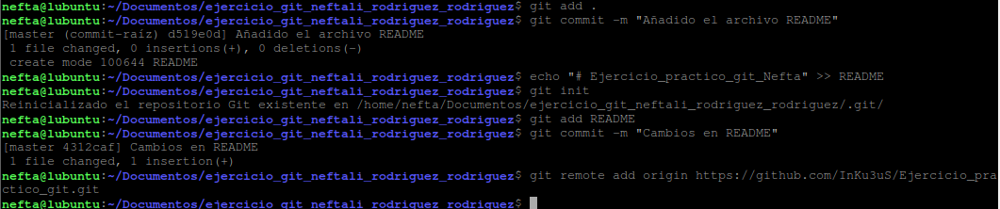
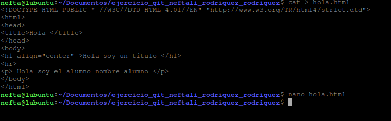
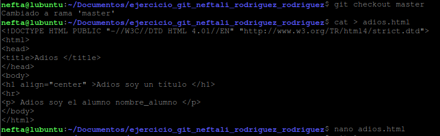
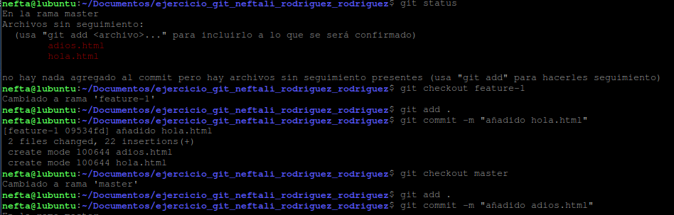
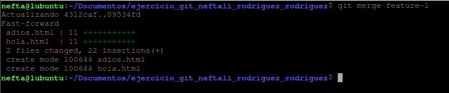
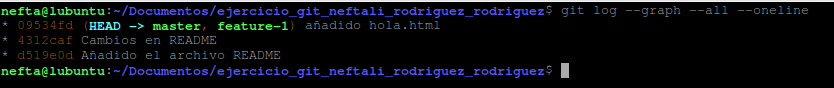

## **Ejercicio Practico**

**Neftalí Rodríguez Rodríguez**

[**Github**](https://github.com/InKu3uS/)

**Indice**

[Ejercicio Practico	1](#id1)

[1. Primera parte	2](#id2)

[2. Segunda parte	2](#id3)

[3. Tercera parte	3](#id4)

[4. Cuarta parte	3](#id5)

[5. Quinta parte	4](#id6)

## **1. Primera parte**

Creamos la carpeta “**ejercicio\_git\_neftali\_rodriguez\_rodriguez**”

Creamos el archivo **README.**

Inicializamos el repositorio con **git init**

Añadimos el **README** al repositorio usando **git add README**

Realizamos el primer **commit con git commit -m “Cambios en el README”**

Con el comando **git remote add origin “ruta del repositorio”** lo enlazamos con nuestro repositorio remoto.

## **2. Segunda parte**

Crearemos una nueva rama llamada f**eature-1** con el comando **git branch feature-1** y nos movemos a ella con **git checkout feature-1**

crearemos el archivo **hola.txt** con el siguiente contenido que se ve en la imagen. Modificamos el archivo para incluir nuestro nombre.

Añadimos los cambios con git add hola.html

Realizamos el commit con **git commit -m “Añadido el archivo hola.html”**

## **3. Tercera parte**

Nos movemos nuevamente a la rama master con **git checkout master**

creamos el archivo adios.html con **cat > adios.html**

## **4. Cuarta parte**

Añadimos los dos archivos a la zona de intercambio temporal con **git add .** (Lo haremos en ambas ramas).

Luego haremos los commits de ambos archivos con el comando **git commit -m “mensaje del commit”**

Luego nos movemos a la rama master y realizamos la mezcla con **git merge feature-1**

## **5. Quinta parte**

Por último, revisamos los cambios en el repositorio con **git log –graph –all --oneline**

