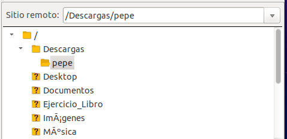

## **Instalación de Servidor FTP**

**Neftalí Rodríguez Rodríguez**

[**Github**](https://github.com/InKu3uS/)

**Indice**

[Instalación de Servidor FTP](#id1)

[1. Parte 1](#id1)

[2. Parte 2](#id2)

[3. Parte 3](#id3)

[4. Parte 4](#id4)

[5. Parte 5](#id5)

[6. Parte 6](#id6)

[7. Parte 7](#id7)

[8. Parte 8](#id8)

## **1. Parte 1** 

Antes de empezar haremos un **“apt update”** para actualizar la lista de paquetes.

## **2. Parte 2**

Luego instalaremos FTP usando **“apt install -y vsftpd”**

## **3. Parte 3**

Añadimos las reglas al **firewall** para los puertos estandar de **FTP** y para el puerto de datos del **modo activo.**

## **4. Parte 4**

Intentamos acceder al ftp desde navegador sin conseguirlo. Haciendo una búsqueda por internet parece ser que los navegadores están optando por desactivar por defecto a servidores **FTP**.

En cambio, si intentamos acceder desde el comando **“ftp”** de la terminal, podremos acceder sin problema.

## **5. Parte 5**

Abrimos una terminal e instalamos **Filezilla** mediante el comando **“apt install filezilla”**

## **6. Parte 6**

Abrimos el archivo **“etc/vsftpd.conf”** y añadimos las 3 ultimas lineas que aparecen  en la imagen al final del fichero

Una vez guardados los cambios en el fichero, permitimos en el firewall el acceso a dichos puertos.

Comprobamos desde la terminal que al acceder via FTP, una vez conectados podemos activar el **modo pasivo**

## **7. Parte 7**

Volvemos al archivo **“etc/vsftpd.conf”** para activar las directivas que aparecen en la siguiente imagen. Para que los usuarios locales puedan acceder al servidor FTP, y la segunda hace que los usuarios locales puedan escribir en sus directorios.

Por último activamos las siguientes dos directivas, que harán que el usuario solo pueda navegar por sus directorios personales y que no pueda eliminar archivos o directorios esenciales.

## **8. Parte 8**

Por último probamos a conectarnos de nuevo, e intentaremos crear un directorio fuera de la carpeta home del usuario. 

Como se aprecia en la imagen, no se crea el directorio ya que el usuario no tiene permisos para modificar nada fuera de su directorio home.

En cambio si probamos a repetir el proceso en el directorio del usuario comprobaremos que si se pueden efectuar cambios.

