## **Instalación de Jenkins en Ubuntu**

**Neftalí Rodríguez Rodríguez**

[**Github**](https://github.com/InKu3uS/)

Indice

[Instalación de Jenkins en Ubuntu](#id1)

[1. Parte 1](#id1)

[2. Parte 2](#id2)

[3. Parte 3](#id3)

[4. Parte 4](#id4)

[5. Parte 5](#id5)

[6. Parte 6](#id6)

## **1. Parte 1** 

Antes de comenzar el ejercicio, vamos a crear un dominio nuevo en el servidor apache con el nombre **“www.neftaic.com”** y lo añadimos a /*etc/*hosts

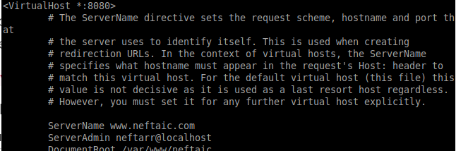

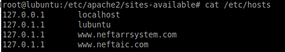

## **2. Parte 2** 

Antes de empezar añadiremos los repositorios de Jenkins al sistema.

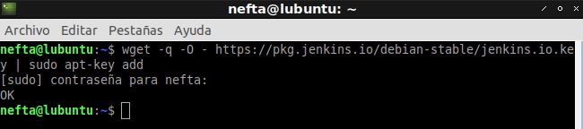

Luego añadimos la dirección del repositorio al archivo **“sources.list”**

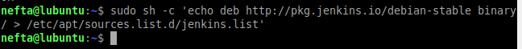

Luego realizamos un **“apt update”**

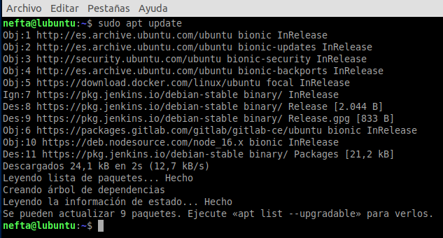

Una vez termine ejecutamos **“apt install jenkins”**

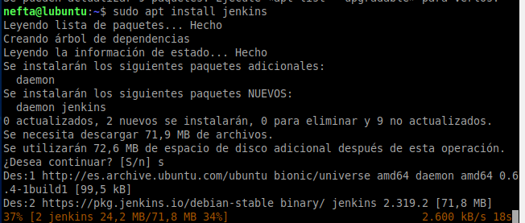

## **3. Parte 3** 

Arrancamos el servicio de jenkins

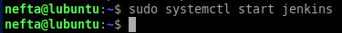

Luego introducimos **“systemctl status jenkins”** para comprobar que el servicio se encuentra activo.

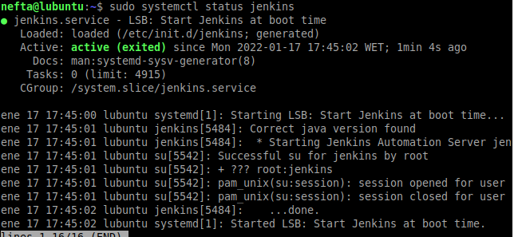

## **4. Parte 4** 
Permitimos las conexiones  desde el puerto 8080 y OpenSSH en el Firewall. Luego guardamos los cambios con **“sudo ufw enable”.**

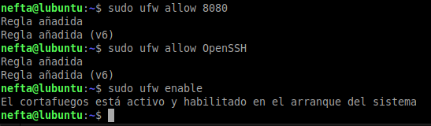

Luego ejecutamos **“sudo ufw status”** para comprobar que se han guardado los cambios.

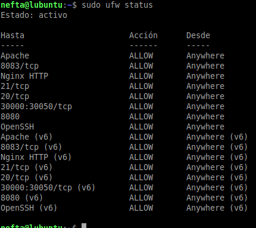

## **5. Parte 5** 

Accedemos al dominio que creamos anteriormente y deberiamos ver la pagina de inicio de Jenkins.

Luego introducimos el comando **“sudo cat /var/lib/jenkins/secrets/initialAdminPassword”** para ver la contraseña de desbloqueo de Jenkins, la copiamos y pegamos en dicha pagina

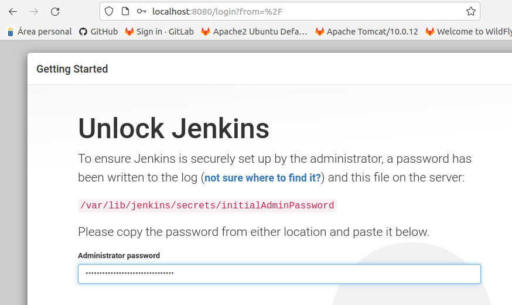

Al introducir la contraseña veremos la siguiente pagina, en ella haremos click en **“install suggested plugins”.** De esa manera, se instalaran los plugins necesarios para usar Jenkins

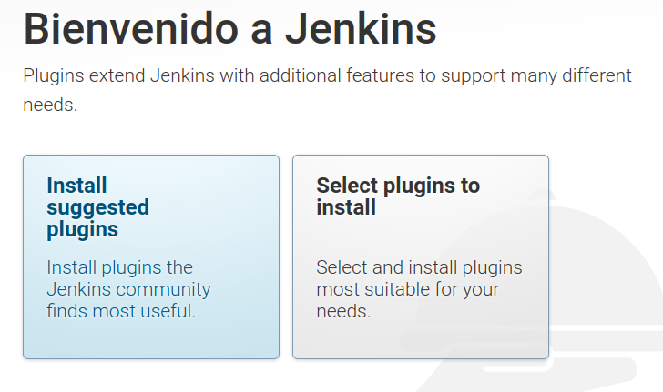

Esperamos a que terminen de instalarse los plugins.

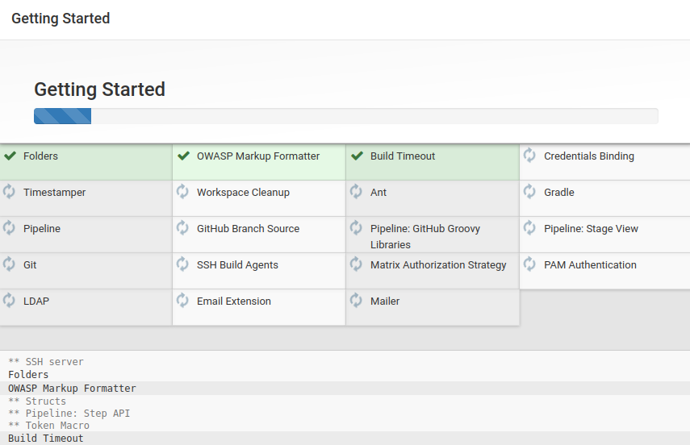

## **6. Parte 6** 

Una vez termine el proceso de instalación de los plugins veremos la siguiente pagina. En esta crearemos un usuario con el que haremos uso de Jenkins.

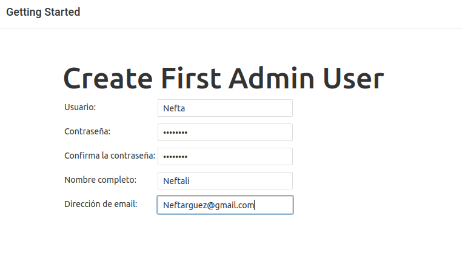

Una vez creado el usuario, ya podremos hacer uso de Jenkins.

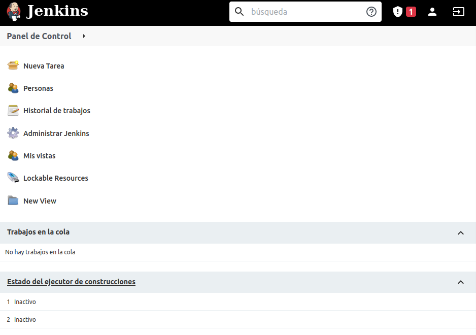
