## **Instalación de Nginx**

**Neftalí Rodríguez Rodríguez**

[**Github**](https://github.com/InKu3uS/)

**Indice**

[1. Primera parte](#id1)

[2. Segunda parte](#id2)

[3. Tercera parte](#id3)

[4. Cuarta parte](#id4)

[5. Quinta parte](#id5)

[6. Sexta parte](#id6)

[7. Septima parte](#id7)

[8. Octava parte](#id8)

## **1. Primera parte**

Comenzaremos por hacer **“sudo apt update”** para actualizar los repositorios. Una vez termine escribiremos **“apt install nginx”**

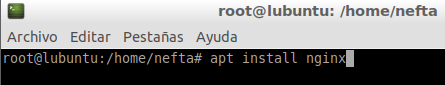

## **2. Segunda parte**

Una vez terminado el proceso de instalación añadiremos nginx a la lista de excepciones del firewall. Para ello usaremos el comando **“ufw app list”** para ver la lista de aplicaciones, luego escribiremos **“ufw allow ‘Nginx HTTP’”** para añadir a Nginx a la lista de excepciones.

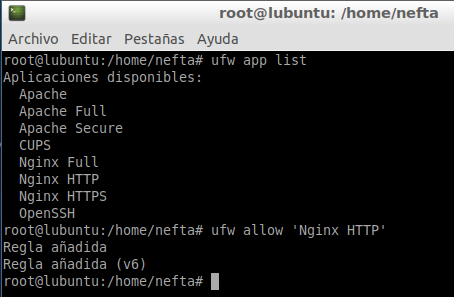

Luego usaremos **“ufw status”** para comprobar que **NginX HTTP** se encuentra en estado **ALLOW**

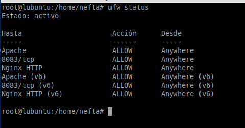

## **3. Tercera parte**

Una vez hayamos hecho lo anterior. Haremos un **“systemctl status nginx”** para comprobar el estado del servicio. Como vemos en la imagen a continuacion se encuentra cargado pero inactivo.

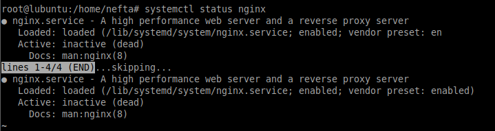

Para activarlo y arrancarlo usaremos los comandos **“systemctl enable nginx”** para que el SO lo cargue al arrancar y luego **“systemctl start nginx”** para iniciar el servicio

Una vez hayamos arrancado el servicio, abriremos un navegador e introduciremos en la barra de direcciones la **IP publica** del servidor (la podemos averiguar en paginas como **“whatsmyip”**) y nos debería aparecer la pagina que se muestra a continuacion, la cual nos indica que nginx esta funcionando correctamente.

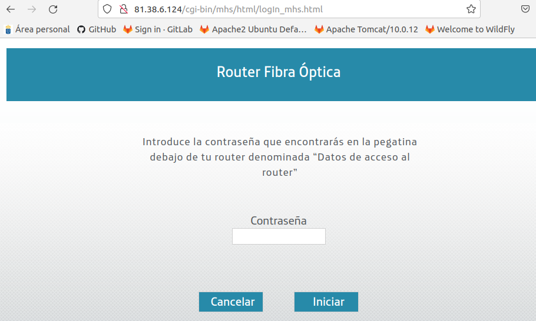

## **4. Cuarta parte**

Una vez hayamos comprobado que nginx se encuentra funcionando correctamente, crearemos un nuevo directorio dentro de __/*var/www/*__* asignaremos al propietario del directorio y los permisos dentro de este mediante los tres comandos que aparecen en la siguiente imagen.

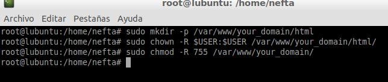

## **5. Quinta parte**

Luego, dentro del directorio que acabamos de crear, creamos un nuevo archivo simple HTML como el que aparece en la imagen.

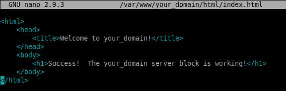

## **6. Sexta parte**

A continuacion copiaremos el archivo de configuración por defecto de nginx a la carpeta creada en pasos anteriores mediante **“cp /etc/nginx/sites-available/default /etc/nginx/sites-available/your-domain”** y luego lo abrimos con un editor de texto. Debería quedar algo similar a lo que aparece en la imagen.

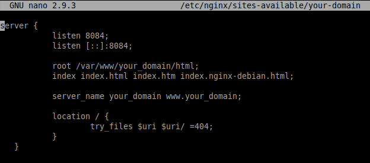

Luego creamos un enlace simbolico de dicho archivo al directorio **“/etc/nginx/sites-enabled/”**

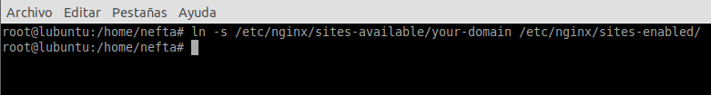

## **7. Septima parte**

Ahora abrimos el archivo **“/etc/nginx/nginx.conf”** y descomentamos la linea **“server\_names\_hash\_bucket\_size 64”**. Guardamos los cambios y cerramos el archivo.

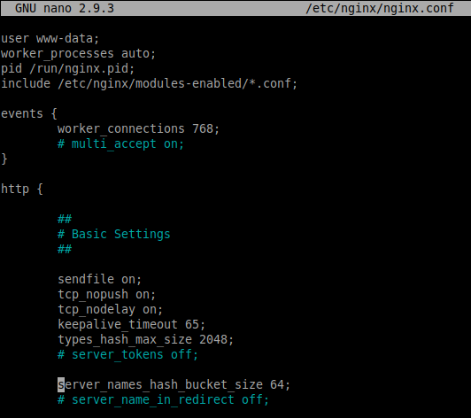

Una vez realizados los cambios en el fichero, ejecutamos el comando **“nginx -t”** para comprobar que la sintaxis dentro de los ficheros de configuracion es la correcta.

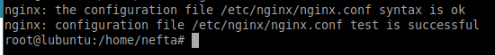

## **8. Octava parte**

Por último, abriremos el navegador e introduciremos la url al dominio que hemos creado. En nuestro caso es **“your\_domain.com:8084”**. Nos debe aparecer la pagina de inicio de Apache.

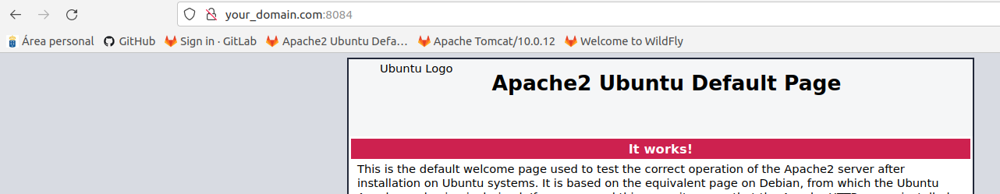
