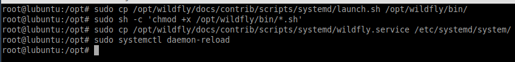

## **Instalación de Wildfly**

**Neftalí Rodríguez Rodríguez**

[**Github**](https://github.com/InKu3uS/)

**"Indice**

[Instalación de Wildfly	1]

[1. Parte 1](#id1)

[2. Parte 2](#id2)

[3. Parte 3](#id3)

[4. Parte 4](#id4)

[5. Parte 5](#id5)

[6. Parte 6](#id6)

[7. Parte 7](#id7)

[8. Parte 8](#id8)

[9. Parte 9](#id9)

[10. Parte 10](#id10)

[11. Parte 11](#id11)

[12. Parte 12](#id12)

[13. Parte 13](#id13)

[14. Parte 14](#id14)

[15. Parte 15](#id15)

## **1. Parte 1**

Antes de comenzar la instalación, realizaremos un “sudo apt update && apt update” para actualizar el sistema y los repositorios.

Ahora ejecutaremos el comando “  wget <https://github.com/wildfly/wildfly/releases/download/25.0.0.Final/wildfly-25.0.0.Final.tar.gz>”

Con esto, nos descargaremos la ultima versión de Wildfly desde su Github oficial.

## **2. Parte 2**

Creamos el usuario y el grupo Wildfly

## **3. Parte 3**

Descomprimimos el paquete que nos descargamos con **“tar -xvzf wildfly-25.0.0.Final.tar.gz”** y lo movemos a **/*opt*/wildfly**

## **4. Parte 4**

Creamos un enlace simbolico al directorio.

## **5. Parte 5**

Posteriormente haremos propietario del directorio al usuario wildfly que creamos en pasos anteriores.

## **6. Parte 6**

Creamos el directorio **/*etc*/wildfly** y hacemos una copia del archivo de configuración de wildfly a este nuevo directorio.

Este es el contenido de el archivo **wildfly.conf** que acabamos de copiar

## **7. Parte 7**

Lanzamos los comandos que aparecen en la siguiente imagen para preparar el arranque del servicio

## **8. Parte 8**

Ejecutamos un **“sudo systemctl start wildfly”** y comprobamos que esta arrancado con **“sudo systemctl status wildfly”**

Si wildfly esta activo y sin problemas ejecutaremos **“sudo systemctl enable wildfly”** para que arranque con el sistema.

## **9. Parte 9**

El siguiente paso será modificar el archivo **standalone.xml** que se encuentra en la ruta  **/opt/wildfly/standalone/configuration/**

En este archivo modificaremos la linea en la que aparece el cursor en la imagen, para indicar en que puerto accederemos a Wildfly. En nuestro caso será el **8083**

Tambien deberemos permitir el tráfico a través del puerto 8083 con el comando **“ufw allow 8083/tcp”**

## **10. Parte 10**

El siguiente paso será crear un usuario administrador para Wildfly.

Para ello ejecutaremos el script **“/opt/wildfly/bin/add-user.sh”**

Veremos un asistente que nos guiará en el proceso. Marcaremos la opcion **“a”** para crear un usuario administrador, luego tendremos que indicar el **nombre del usuario**, **contraseña** y nos preguntará si queremos añadir a dicho usuario al grupo **“ManagementRealm”**, indicamos que si y el usuario quedará creado.

## **11. Parte 11**

El siguiente paso será abrir el script **“/*opt/wildfly/bin/launch.sh”*** con un editor de texto*** y comprobar que el contenido es igual al de la siguiente imagen.

## **12. Parte 12**
Luego abriremos el archivo **“/etc/systemd/system/wildfly.service”** y comprobamos que el contenido es el mismo que en la siguiente imagen.

En nuestro caso, hubo que añadir **“$WILDFLY\_CONSOLE\_BIND”** al final de la linea **“ExecStart….”**

## **13. Parte 13**

Tras realizar las modificaciones en ambos archivos reiniciaremos los servicios para asegurarnos que los nuevos cambios se han cargado.

## **14. Parte 14**

Si queremos activar la consola de administración, bastaría con comentar o eliminar las lineas de las etiquetas **inet-address** en el archivo **“/opt/wildfly/standalone/configuration/standalone.xml”**

## **15. Parte 15**

Una vez hayamos completado la instalación y configuración de **Wildfly**, accederemos a él desde nuestro navegador introduciendo **“localhost:8083”**

