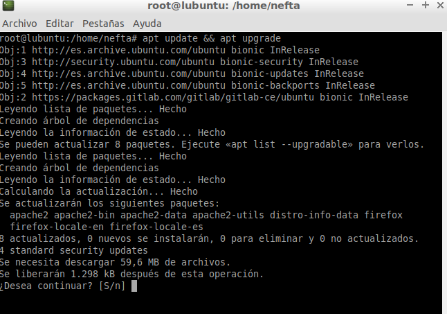
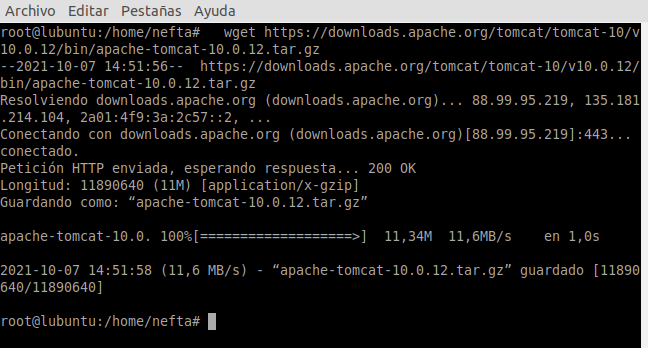
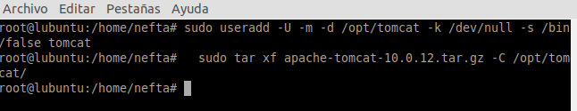
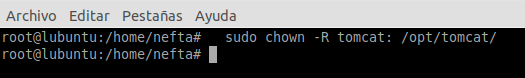
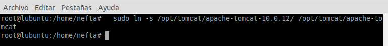
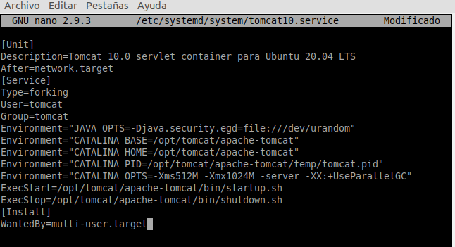
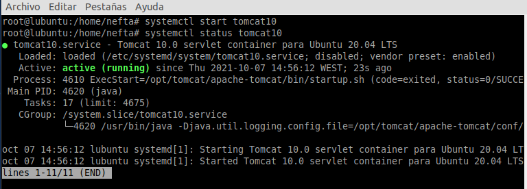
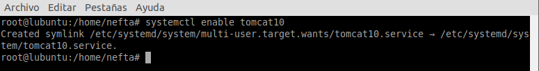
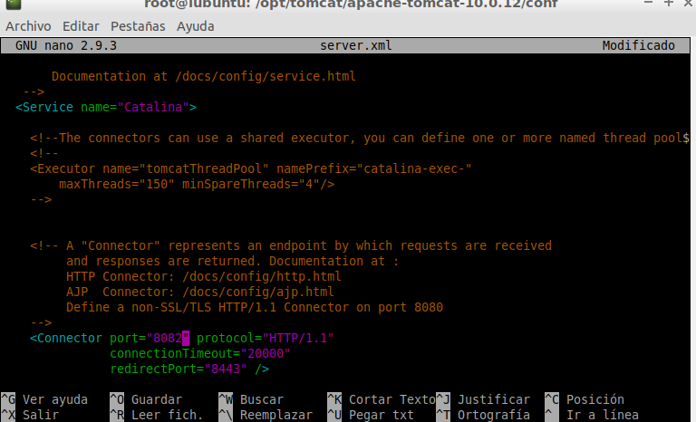
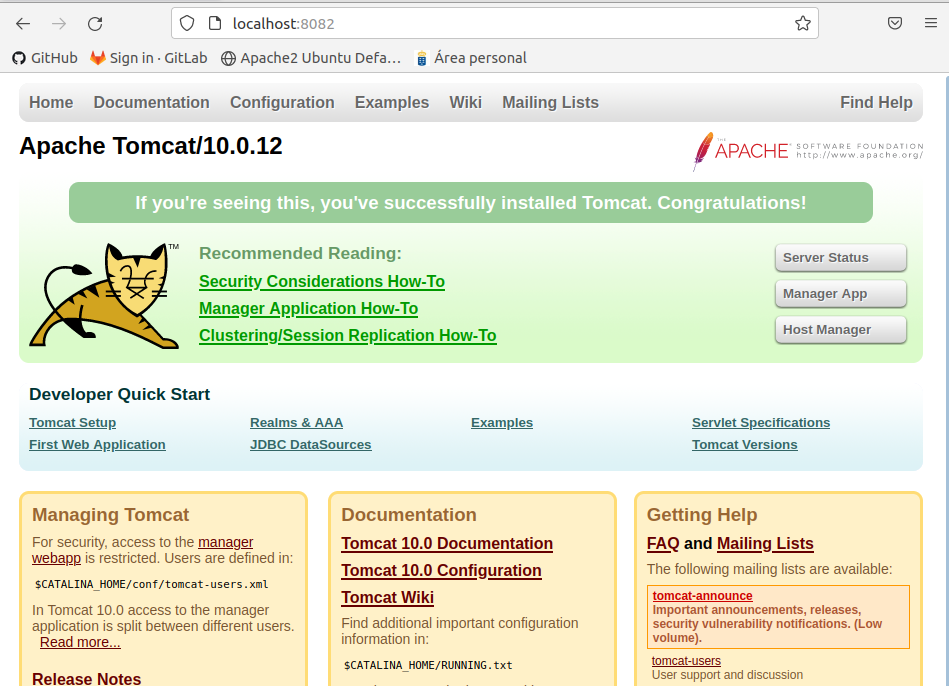

## **Instalación de Apache Tomcat**

**Neftalí Rodríguez Rodríguez**

[**Github**](https://github.com/InKu3uS/)

**Indice**

[Instalación de Apache Tomcat 1]

[1. Primera parte	2](#id1)

[2. Segunda parte	3](#id2)

[3. Tercera parte	3](#id3)

[4. Cuarta parte	4](#id4)

[5. Quinta parte	4](#id5)

[6. Sexta parte	5](#id6)

[7. Septima parte	6](#id7)

[8. Octava parte	7](#id8)

[9. Novena parte	8](#id9)

## **1. Primera parte**

Antes de comenzar la instalación, haremos un sudo apt update && apt upgrade para actualizar el sistema y los repositorios

## **2. Segunda parte**

Lo siguiente que haremos será descargarnos el paquete comprimido de Apache Tomcat. Podremos hacerlo desde el navegador o por consola usando el siguiente comando:

**wget https://downloads.apache.org/tomcat/tomcat-10/v10.0.12/bin/apache-tomcat-10.0.12.tar.gz**

## **3. Tercera parte**

Creamos un usuario para tomcat con el comando

**sudo useradd -U -m -d /opt/tomcat -k /dev/null -s /bin/false tomcat**

Luego descomprimimos el paquete que acabamos de descargar al directorio **/opt/tomcat/** mediante el comando   **sudo tar xf apache-tomcat-10.0.12.tar.gz -C /opt/tomcat/***

## **4. Cuarta parte**

Asignamos como propietario de los archivos de Tomcat al usuario que creamos en el paso anterior usando el comando   **sudo chown -R tomcat: /opt/tomcat/**

## **5. Quinta parte**

Creamos un enlace simbolico del directorio de instalación de Tomcat pero quitando el numero de versión para facilitar la configuración del mismo. Para ello usaremos el comando   **sudo ln -s /opt/tomcat/apache-tomcat-10.0.12/ /opt/tomcat/apache-tomcat**

## **6. Sexta parte**

Lo siguiente será configurar el servicio. Para ello crearemos el archivo

**/etc/systemd/system/tomcat10.service** mediante nano u otro editor de texto con el contenido que aparece en la imagen.

## **7. Septima parte**

Ahora arrancaremos el servicio de tomcat usando el comando **systemctl start tomcat10** y verificamos que ha arrancado correctamente con **systemctl status tomcat10.**

Deberá aparecer un mensaje similar al que aparece en la imagen.

Para que el servicio arranque de manera automatica con el sistema haremos uso del siguiente comando **systemctl enable tomcat10**

## **8. Octava parte**

Tomcat usa por defecto el puerto **8080**, en caso de que otro programa o servicio este utilizando dicho puerto podemos modificarlo.

Para ello abriremos el archivo **server.xml** que se encuentra en la ruta

**/opt/tomcat/apache-tomcat-10.0.12/conf**

Dentro del archivo veremos una linea en la que aparece **“Connector port=8080”**.

Modificaremos el puerto por otro de nuestra eleccion (en nuestro caso 8082)

## **9. Novena parte**

Por último, solo nos queda ingresar desde nuestro navegador a **“localhost:8082”** y deberemos ver la pagina de inicio de Apache Tomcat.

