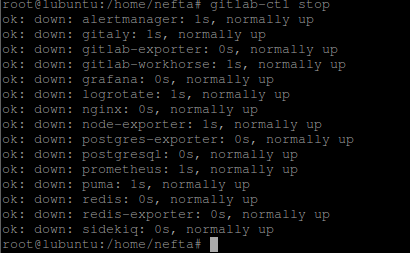
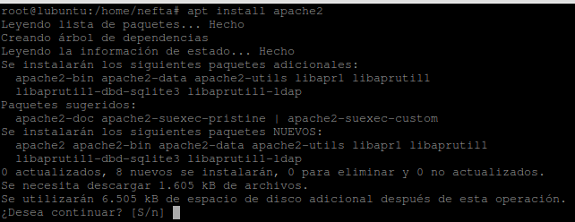
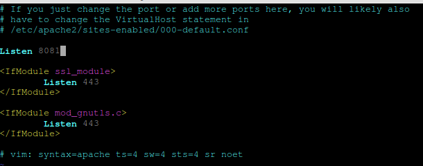
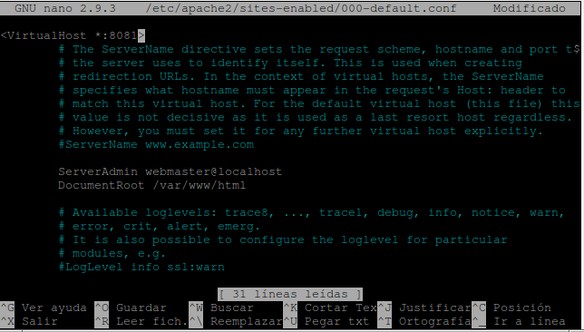
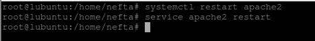
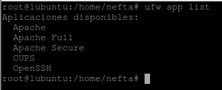
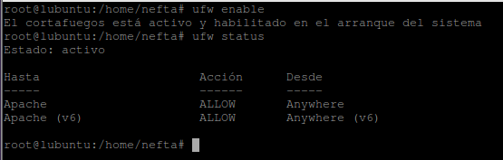
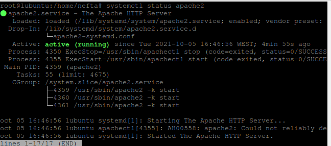
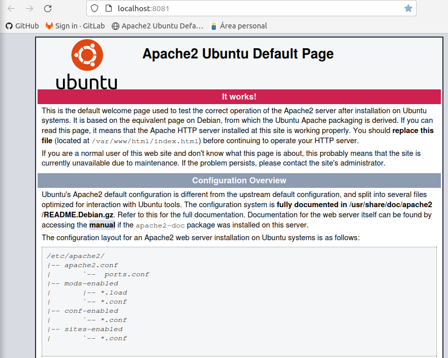

## **Instalación de Apache**

**Neftalí Rodríguez Rodríguez**

[**Github**](https://github.com/InKu3uS/)

**Indice**

[1. Primera parte	2](#id1)

[2. Segunda parte	3](#id2)

[3. Tercera parte	3](#id3)

[4. Cuarta parte	4](#id4)

[5. Quinta parte	5](#id5)

[6. Sexta parte	6](#id6)

[7. Séptima parte	6](#id7)

[8. Octava parte	7](#id8)

[9. Novena parte	7](#id9)

## **1. Primera parte**

Para empezar actualizaremos los repositorios y el sistema operativo mediante los siguientes comandos:

`  `**sudo apt update && sudo apt upgrade**

Esperamos a que se complete el proceso.

Antes de realizar la instalación de Apache, detendremos el proceso de GitLab para que no cause un error la instalación, ya que tanto este como Apache utilizan el puerto 80 por defecto.

## **2. Segunda parte**

Una vez detenido GitLab procederemos a instalar apache mediante el comando **sudo apt install apache2**

## **3. Tercera parte**

Una vez se haya completado la instalación abriremos el archivo **etc/apache2/ports.conf** con cualquier editor y modificamos la linea **Listen 80** por **Listen 8081 y guardamos los cambios.**

## **4. Cuarta parte**

Lo siguiente será modificar el archivo **/etc/apache2/sites-enabled/000-default.conf**

En la primera linea donde pone **<VirtualHost: \*:80>** lo modificaremos por **<VirtualHost: \*:8081>** y guardamos los cambios

## **5. Quinta parte**

Una vez hayamos modificado ambos archivos de los pasos previos, reiniciaremos el servicio apache2 mediante los siguientes comandos.

**sudo systemctl restart apache2**

**sudo service apache2 restart**

## **6. Sexta parte**

Ejecutamos el comando sudo **ufw app list** para ver los perfiles disponibles del firewall. Nos aseguramos que aparece **Apache**.

Abrimos el puerto 80 para Apache. De momento no necesitaremos el puerto 443 asi que con el perfil Apache nos valdría.

Ejecutamos el siguiente comando para hacerlo

`  `**sudo ufw allow 'Apache'**

## **7. Séptima parte**

Una vez hayamos añadido la regla para permitir Apache en el firewall, ejecutamos un **ufw enable** para activar el firewall y a continuación un **ufw status** para comprobar el estado del firewall y comprobar que se ha añadido la regla para permitir Apache

## **8. Octava parte**
Ejecutamos el comando s**udo systemctl status apache2** para comprobar el estado del servicio. Debe aparecer **active (running)**

## **9. Novena parte**

Abrimos el navegador e ingresamos en la barra de direcciones **“localhost:8081”**. Deberemos ver la pagina por defecto de Apache2

