## **Instalación de Docker**

**Neftalí Rodríguez Rodríguez**

[**Github**](https://github.com/InKu3uS/)

**Indice**

[Instalación de Docker](#id1)

[1. Primera parte](#id1)

[2. Segunda parte](#id2)

[3. Tercera parte](#id3)

[4. Cuarta parte](#id4)

[5. Quinta parte](#id5)

[6. Sexta parte](#id6)

[7. Séptima parte](#id7)

[8. Octava parte](#id8)

## **1. Primera parte**

Primero haremos un **“apt update”** para actualizar los repositorios.

A continuación, con el comando **“sudo apt install apt-transport-https ca-certificates curl software-properties-common”** para poder instalar paquetes a traves de HTTPS.

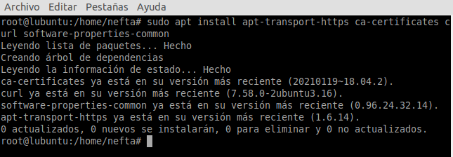
## **2. Segunda parte**
Luego, añadimos la clave **GPG** para el repositorio de **Docker**.

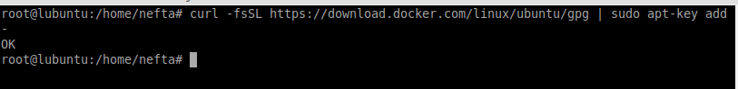

## **3. Tercera parte**
Agregamos el repositorio de **Docker** y ejecutamos un **“apt update”** para actualizar la lista de paquetes

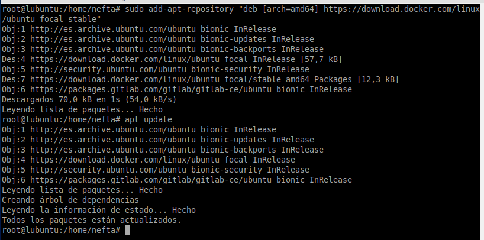

## **4. Cuarta parte**
Comprobamos que el paquete **“docker -ce”** se va a descargar desde el repositorio de **Docker.**

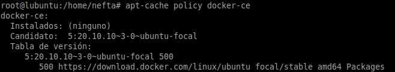

## **5. Quinta parte**
Ejecutamos **“apt install docker-ce”** para instalar comenzar la instalación de **Docker**.

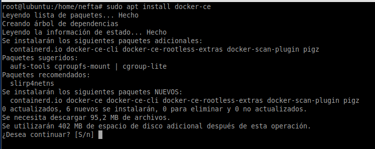
## **6. Sexta parte**
Una vez se haya completado la instalación, comprobamos que **Docker** esta activo con el comando **“systemctl status docker”**

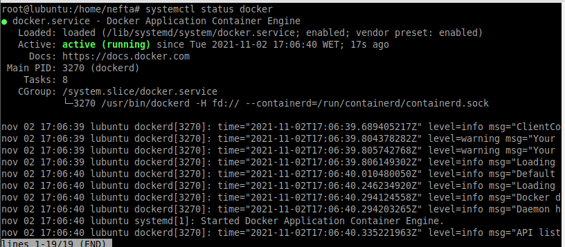

## **7. Séptima parte**
Usamos el comando **“docker run hello-world”** para comprobar que podemos acceder y descargar imágenes de **Docker**.

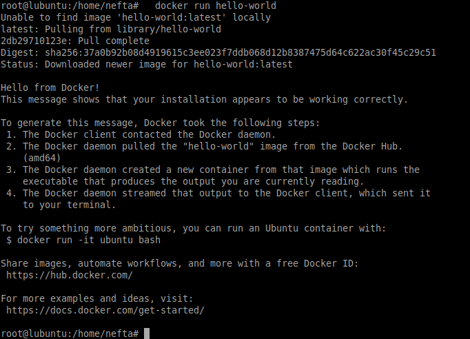

## **8. Octava parte**
Mediante el comando **“docker ps”** podremos ver los contenedores activos.

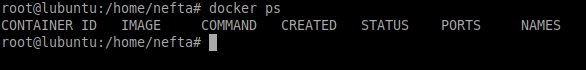

Con el comando **“docker ps -a”** veremos los contenedores activos e inactivos.

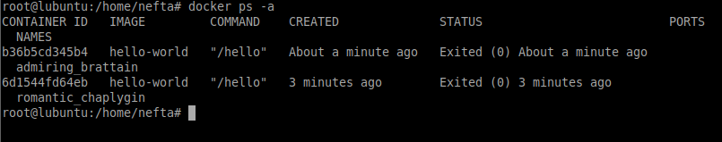

Mediante el comando **“docker ps -l”** podremos comprobar cual fue el ultimo contenedor cargado.

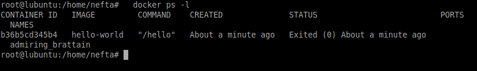

Por último mediante el comando **“docker  images”** se nos mostrara todas las imágenes de Docker en nuestro equipo.

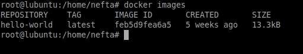

