## **Instalación de Git en Linux**

**Indice**

[1. Explicación del ejercicio](#id1)

[2. Instalación de Git](#id2)

[3. Comprobación de la versión instalada](#id3)

[4. Instalación de dependencias](#id4)

[5. Descarga del paquete](#id5)

[6. Descomprimir el paquete descargado](#id6)

[7. Creación del paquete e instalación](#id7)

[8. Sustitución del proceso en la shell y comprobación de versión](#id8)

[9. Configuración de usuario de Git](#id9)

[10. Modificación del archivo gitconfig](#id10)

## **1. Explicación del ejercicio**

En este ejercicio vamos a realizar la instalación de **Git** mediante el gestor de paquetes de Linux. Comprobaremos la versión instalada, y si fuera necesario actualizaríamos a una versión mas reciente. Por último, configuraremos el nombre de usuario y el correo electrónico del usuario de Git.

## **2. Instalación de Git**

Para instalar Git deberemos abrir un terminal e introducir el siguiente comando **“sudo apt install git”** (después de haber hecho un “**sudo apt update”** para actualizar la lista de paquetes). Nos saldrá la lista de paquetes a instalar, pulsamos la letra **S**, luego **Enter** y esperamos a que se complete la instalación.

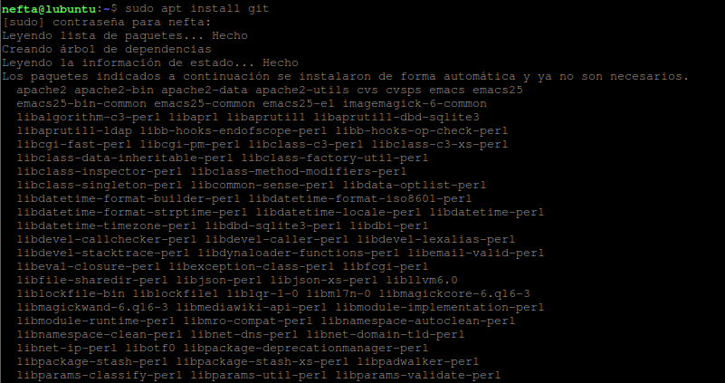

## **3. Comprobación de la versión instalada**

Para comprobar que versión se nos ha instalado a través del gestor de paquetes teclearemos el siguiente comando en la terminal **“git - -version”**.

En la salida de la terminal se nos mostrará la versión de Git que tenemos instalada.

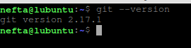

## **4. Instalación de dependencias**

Ya que la instalación desde el gestor de paquetes de Linux no nos ha instalado la versión mas reciente de Git vamos a proceder a la instalación manual. Para ello antes de nada haremos un **“sudo apt update”** y esperamos a que termine de actualizar la lista de paquetes. Una vez haya terminado instalaremos las dependencias de Git mediante el siguiente comando **“sudo apt install libz-dev libssl-dev libcur14-gnutls-dev libexpat1-dev gettext cmake gcc”.** Esperamos a que se complete la instalación.

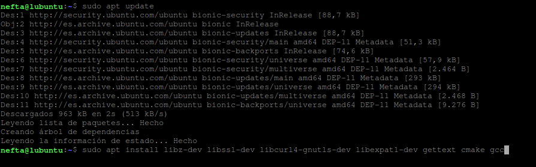

##
## **5. Descarga del paquete**

Para comenzar este paso, nos dirigiremos a nuestra carpeta personal **“home/nefta”** y una vez ahi crearemos una carpeta temporal y accedemos a ella como se muestra en la siguiente imagen.

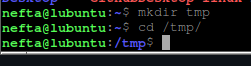

Una vez en nuestra carpeta temporal podemos acceder a esta web [**https://mirrors.edge.kernel.org/pub/software/scm/git/**](https://mirrors.edge.kernel.org/pub/software/scm/git/), en ella aparecen listadas diferentes versiones de Git. Solo tenemos que hacer click en el enlace del paquete que nos interese y pulsar en **copiar enlace** (en nuestro caso instalaremos la version **2.29.3**). Una vez hecho esto volvemos a la terminal e introduciremos el siguiente comando **“curl -o git.tar.gz https://mirrors.edge.kernel.org/pub/software/scm/git/git-2.29.3.tar.gz”.** Esperamos a que finalice la descarga.

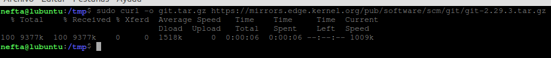

## **6. Descomprimir el paquete descargado**

Una vez se haya completado la descarga introduciremos el siguiente comando para descomprimirlo **“tar -zxf git.tar.gz”**, cuando se haya descomprimido accedemos al nuevo directorio que se habrá creado.

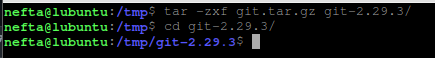

## **7. Creación del paquete e instalación**

Una vez hayamos accedido a la nueva carpeta introduciremos el siguiente comando para preparar la instalación **“make prefix=/usr/local all”**

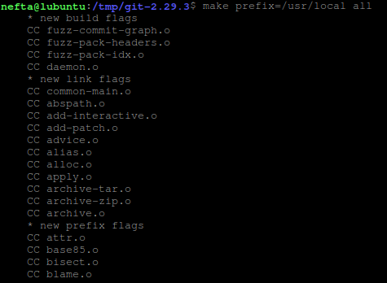

Una vez completado el proceso introduciremos el comando **“sudo make prefix=/usr/local install”** para que comience la instalación. Esperamos a que se complete el proceso de instalación.

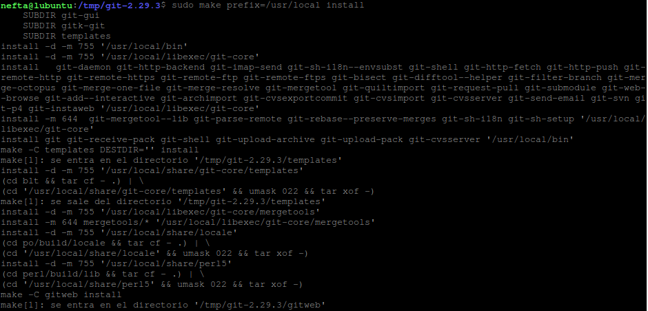

## **8. Sustitución del proceso en la shell y comprobación de versión**

Mediante el comando **“exec bash”** actualizaremos la shell para que utilice la ultima versión de Git que acabamos de instalar.

Luego introducimos una vez mas **“git - - version”** para comprobar que ahora Git está en la versión que acabamos de instalar.

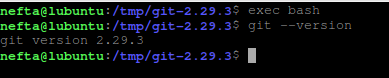

## **9. Configuración de usuario de Git**

Ya hemos terminado con el proceso de instalación. Ahora pasaremos a la configuración de usuario de Git. En concreto el nombre y el correo del usuario.

Para introducir el nombre del usuario lo haremos a traves del siguiente comando **“git config --global user.name NombreDelUsuario”**

Para configurar el correo electrónico lo haremos de la siguiente manera
**“git config --global user.email Correo@DelUsuario.es”**

Para ver que los cambios se han realizado con éxito ejecutaremos el comando **“git config - - list”**

En los resultados deberemos ver las salidas **“user.name”** y **“user.email”**

Comprobaremos que los valores son los correctos.

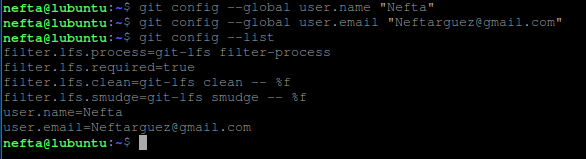

## **10.  Modificación del archivo gitconfig**

**
En el caso de que hayamos introducido algún dato de la configuración de manera errónea podemos modificarlo a través del archivo **“gitconfig”.**

Accederemos a el desde nuestra carpeta personal asi que nos posicionaremos en ella. En nuestro caso usaremos el editor por consola **Nano** asi que introducimos **“nano .gitconfig”.**

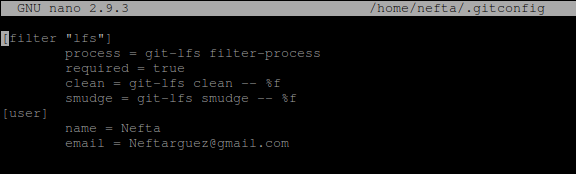

En caso de haber cometido un error en la configuración, lo modificaremos y al terminar presionamos **CTRL+X**. Nano nos preguntara si queremos guardar los cambios, presionaremos la tecla **“S”** y **Enter** para confirmar.
