## **Instalación de Jenkins en Docker**

**Neftalí Rodríguez Rodríguez**

[**Github**](https://github.com/InKu3uS/)

Indice

[Instalación de Jenkins en Docker	1](#id1)

[1. Creación de subdominio para Jenkins	1](#id1)

[2. Instalación de Jenkins con Docker	2](#id2)

## **1. Creación de subdominio para Jenkins**

Antes de comenzar el ejercicio, vamos a crear un dominio nuevo en el servidor apache con el nombre “[www.](http://www.neftaic.com/)[jenkins.](http://www.neftaic.com/)[nefta.com](http://www.neftaic.com/)” y lo añadimos a **/*etc/*hosts**

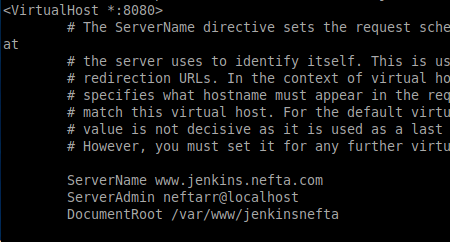

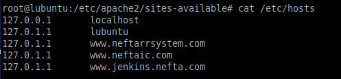

Luego creamos el directorio **“jenkinsnefta”** en **“/var/www/”**

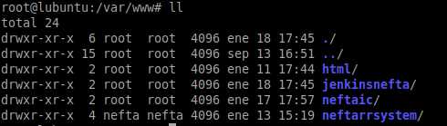

## **2. Instalación de Jenkins con Docker**

Abrimos una terminal y descargamos la imagen de Jenkins desde los repositorios de Docker con el comando **“docker pull jenkins/jenkins:lts”**

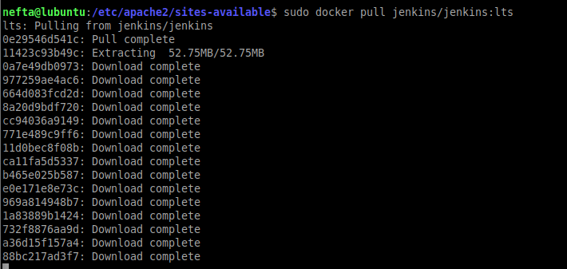

Una vez terminada la descarga comprobaremos que esta en la lista de imágenes con el comando **“docker images”**

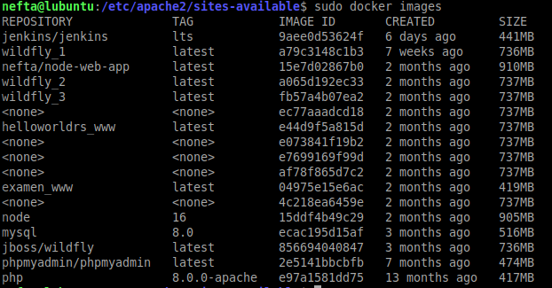

Arrancamos el contenedor de Docker que nos acabamos de descargar mediante el comando **“docker run -p 8080:8080 -p 50000:50000 -v /home/nefta:/var/jenkins\_home jenkins/jenkins:lts”**

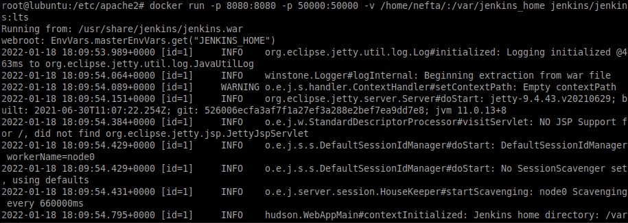

Una vez arrancada, mediante el comando **“docker exec -it dockerjenkins\_pensive\_wu cat /var/jenkins\_home/secrets/initialAdminPassword”** obtendremos el código para desbloquear Jenkins

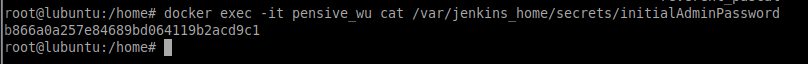

Introducimos la URL de nuestro dominio a través del puerto **8080** y veremos la pagina inicial de Jenkins donde se nos pedirá la contraseña que obtuvimos en el paso anterior. Una vez introducida veremos la siguiente pagina de bienvenida. En ella haremos click en **“Install suggested plugins”**.

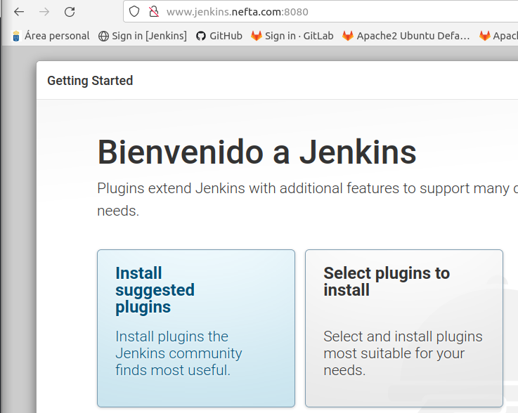

Esperamos a que se instalen los **plugins.**

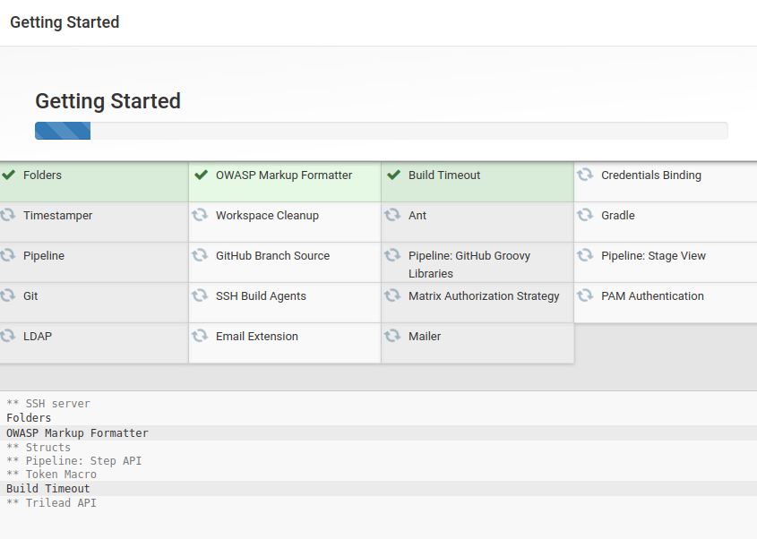

Una vez se hayan instalado los **plugins**, nos aparecerá la siguiente pagina en la que deberemos crear al usuario que usaremos para **Jenkins**

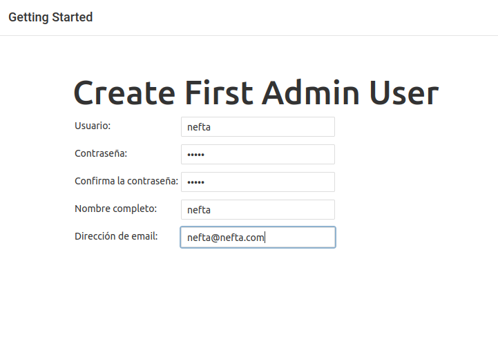

Una vez creado, estaremos en el **Panel de Control de Jenkins** y la instalación habrá terminado.

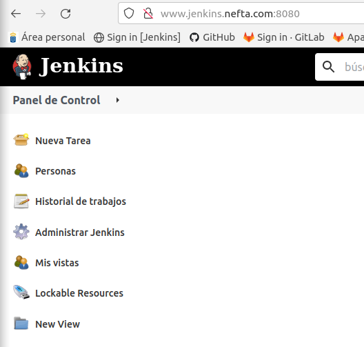

**3. Instalación de Jenkins con Docker y Docker-compose**

Creamos un directorio para guardar los archivos que crearemos a continuación, dentro de este crearemos otro al que llamaremos **“jenkins”** y dentro de este crearemos el archivo **Dockerfile** que se ve a continuación.

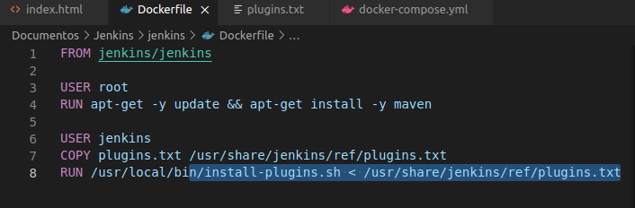

Dentro del directorio **“jenkins”** también crearemos el archivo **“plugins.txt”** que contendrá la lista de plugins que se instalarán en **Jenkins**.

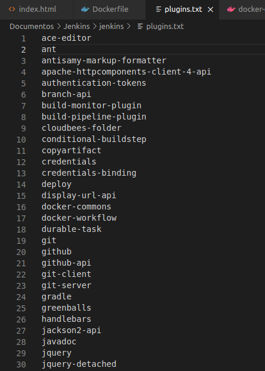

En el directorio principal crearemos el archivo **“docker-compose.yml”** que se ve en la imagen siguiente.

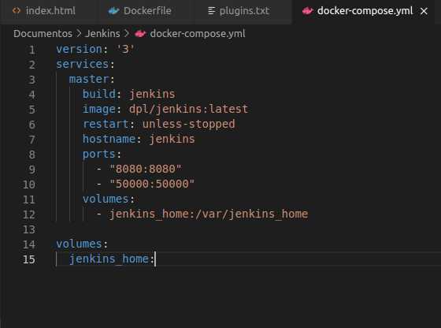

Una vez tengamos estos tres archivos creados, ejecutamos en la terminal el comando **“docker-compose build”**. Si todo sale correctamente al final deberíamos ver el mensaje **“Successfully built”.**

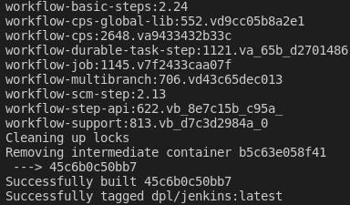

Para arrancar el contenedor, usaremos el comando **“docker-compose up -d”**. Si el contenedor se arranca correctamente nos aparecerá en la terminal un mensaje en color verde diciendo **“done”**. Podremos comprobar que el contenedor está arrancado con el comando **“docker-ps”.**

**NOTA:** Durante este paso, el contenedor no podía arrancarse debido a que no se encontraban ciertos plugins incluidos en el archivo **“plugins.txt”**. Al borrar los cuatro plugins que no se encontraban en los repositorios, el contenedor arrancó sin mas problemas.

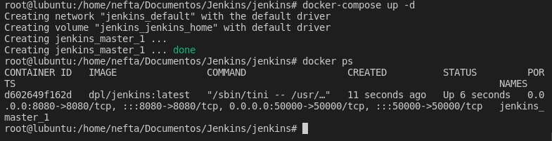

Ejecutamos en una consola el comando **“docker exec -it dockerjenkins\_master\_1 cat /var/jenkins\_home/secrets/initialAdminPassword”** para obtener la clave de desbloqueo de Jenkins.

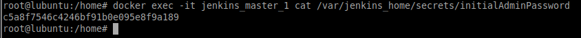

Entramos al navegador con la dirección del subdominio. Nos aparecerá la pagina en la que deberemos introducir la clave de desbloqueo que obtuvimos en el paso anterior. Nos aparecerá la pagina siguiente, clickaremos en **“Install suggested plugins”** para continuar.

Esperamos a que se instalen los plugins. **Esta vez ya muchos se encontrarán instalados**.

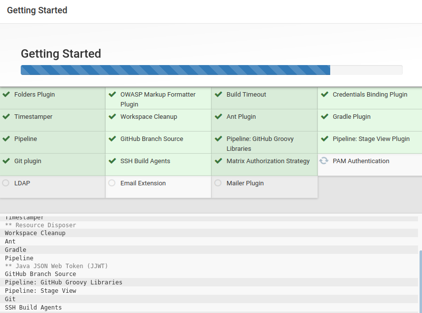

Una vez instalados, crearemos al usuario que hará uso de **Jenkins**.

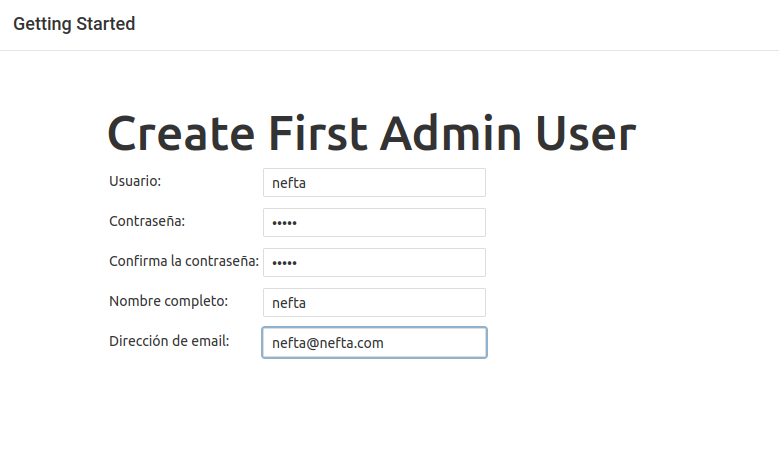

Cuando hayamos creado al usuario, nos encontraremos en el **Panel de Control** de **Jenkins** listo para usar.

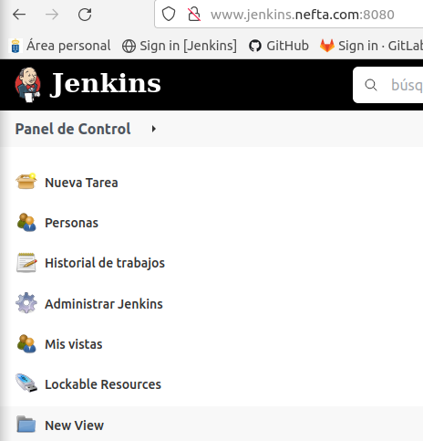

