## **Instalación de servicios REST/WS en Wildfly**

**Neftalí Rodríguez Rodríguez**

[**Github**](https://github.com/InKu3uS/)

**Indice**

[Instalación de servicios REST/WS en Wildfly](#__RefHeading___Toc445_2750294972)

[1. Primera parte](#id1)

[2. Segunda parte](#id2)

[3. Tercera parte](#id3)

[4. Cuarta parte](#id4)

[5. Quinta parte](#id5)

[5. Sexta parte](#id6)

## **1. Primera parte**

Antes de empezar con la práctica, deberemos acceder a al enlace <https://github.com/wildfly/quickstart/> y descargarnos el repositorio.

Una vez descargado, descomprimimos los proyectos de pruebas que vamos a usar. En nuestro caso serán **“helloworld-ws”** y **“helloworld-rs”.**

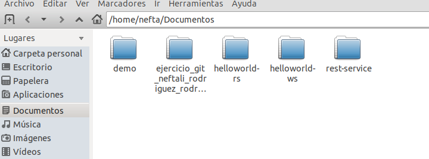

## **2. Segunda parte

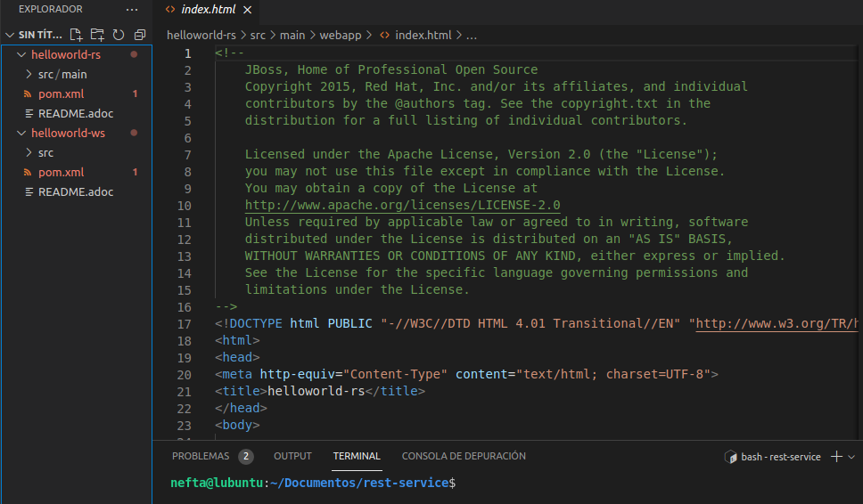

Una vez descomprimidos los proyectos, los abrimos con **VSCode**, abrimos un terminal dentro del proyecto **“helloworld-rs”.**

En la terminal ejecutamos el comando **“mvn clean install”**

y esperamos a que maven descargue las librerias necesarias y cree el archivo **war** del proyecto.

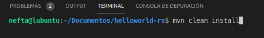

## **3. Tercera parte**

Cuando el proceso del paso anterior haya terminado, accederemos a Wildfly desde nuestro navegador mediante la url **“localhost:8083”** y abriremos la consola de administración de Wildfly. Luego nos moveremos a **“Deployments”**, pulsaremos sobre el boton **+** que aparece en la imagen y clickaremos en **“Upload Deployment”.**

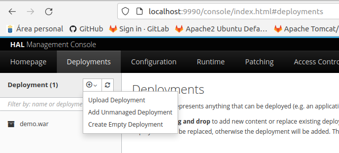

En la nueva ventana que se abrirá, buscaremos el archivo **war** que queremos desplegar y pulsaremos en **Next**, luego Wildfly nos preguntará si queremos cambiar el nombre del proyecto y por ultimo pulsaremos en **Finish**.

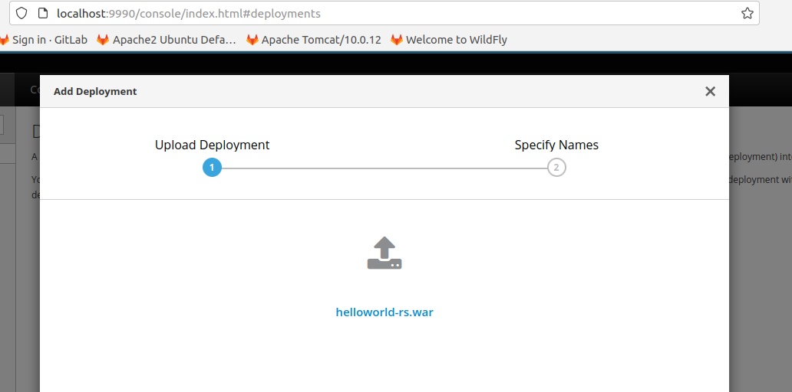

## **4. Cuarta parte**

Una vez desplegado, si hacemos click sobre el proyecto podemos ver un breve resumen del estado del proyecto, así como un enlace para acceder a él.

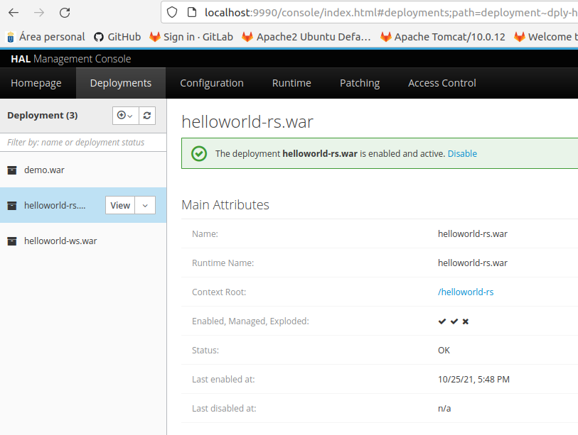

Haremos click en el enlace y probaremos que el proyecto funciona correctamente

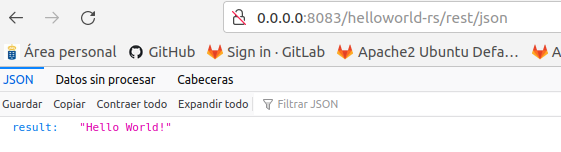

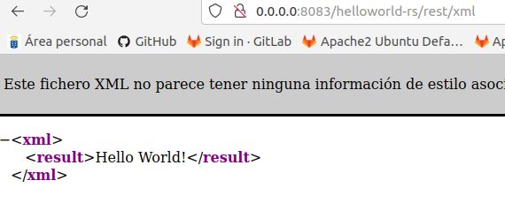

## **5. Quinta parte**

Ahora haremos lo propio con el proyecto **“helloworld-ws”**, abriremos una terminal dentro del proyecto desde **VSCode** e introducimos el comando **“mvn clean install”**. Esperaremos a que se complete el proceso.

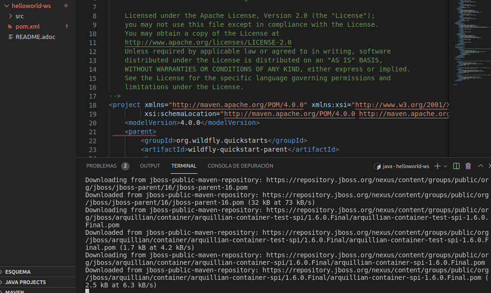

## **5. Sexta parte**

Ahora volveremos a la consola de administración de Wildfly para repetir el proceso y desplegar el nuevo **war** que se nos ha generado.

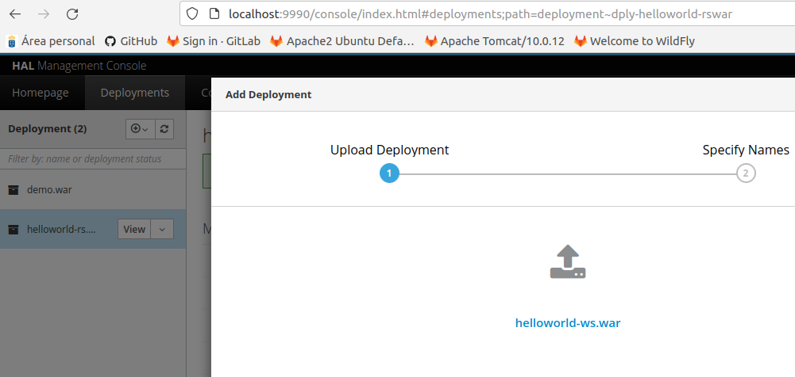

Una vez se haya completado el despliegue, veremos la ventana de características del proyecto donde se nos indica que se ha completado el despliegue.

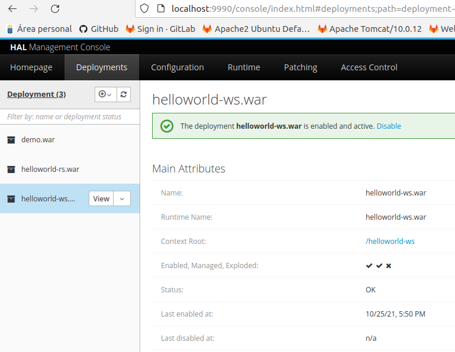

Haremos click en el enlace para comprobar que funciona correctamente.

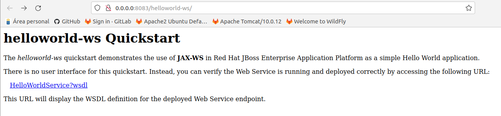
