## **LAMMP con Docker**

**Neftalí Rodríguez Rodríguez**

[**Github**](https://github.com/InKu3uS/)

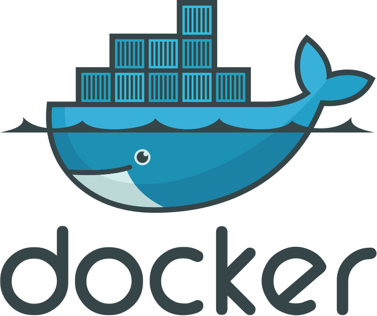

**Indice**

[LAMMP con Docker](#id1)

[1. Parte 1](#id1)

[2. Parte 2](#id2)

[3. Parte 3](#id3)

[4. Parte 4](#id4)

[5. Parte 5](#id5)

[6. Parte 6](#id6)

[7. Parte 7](#id7)

[8. Parte 8](#id8)

## **1. Parte 1**

Creamos el archivo **Dockerfile** en la raiz de nuestro proyecto con el siguiente contenido

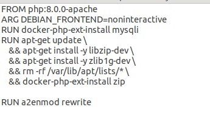

## **2. Parte 2**

A continuacion, el archivo **“docker-compose.yml”** con el siguiente contenido

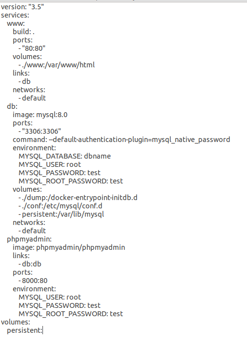

## **3. Parte 3**

Creamos el archivo sql en el directorio dump que creará nuestra base de datos en el contenedor **“db”**

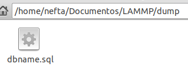

Este será el contenido de **“dbname.sql”**

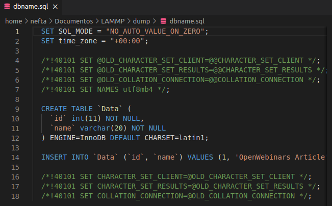

## **4. Parte 4**

Luego creamos el archivo **“index.php”** en el directorio www

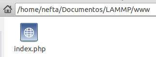

Con el contenido que se ve en la siguiente imagen.

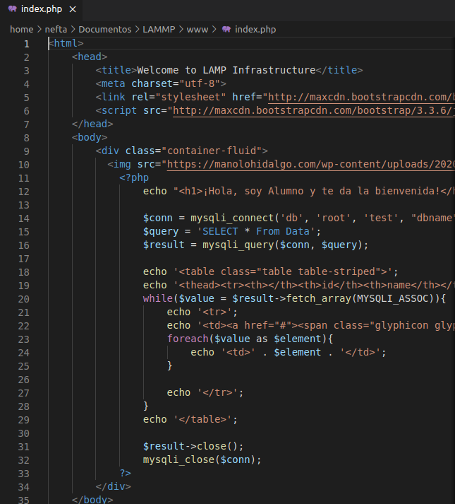

## **5. Parte 5**

Ejecutamos el comando **“docker-compose up -d”** para crear los contenedores

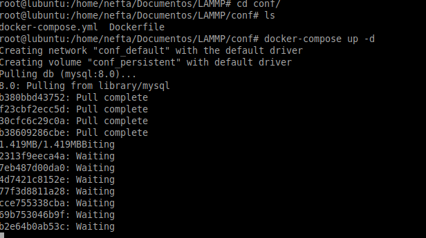

Ejecutaremos **“docker-compose ps”** y veremos que el contenedor **“conf\_db1”** no esta arrancado

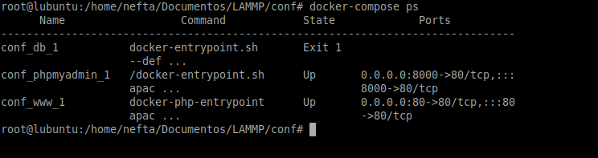

Si revisamo el log de dicho contenedor, se nos avisa de que el usuario root ya existe y no puede crearse.

Paramos todos los contenedores mediante **“docker-compose down –volumes”** ya que será necesario hacer cambios en el archivo **“docker-compose.yml”**

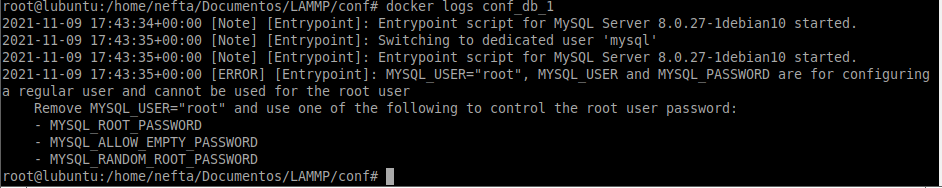

## **6. Parte 6**

Una vez abierto el archivo, modificamos la linea **“MYSQL\_USER”** que anteriormente tenia el valor **“root”** por otro de nuestra elección.

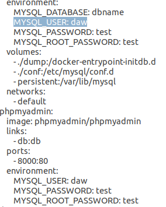

## **7. Parte 7**

Volvemos a ejecutar **“docker-compose up -d”** para crear los contenedores de nuevo y vamos al navegador. Introducimos la dirección **127.0.0.1:8000** y nos deberá aparecer la pagina de inicio de sesión de **MySQL**. Nos logueamos con el usuario y la contraseña que aparece en el archivo **“docker-compose.yml”** y nos loguearemos en MySQL y deberemos tener la base de datos **“dbname”** creada.

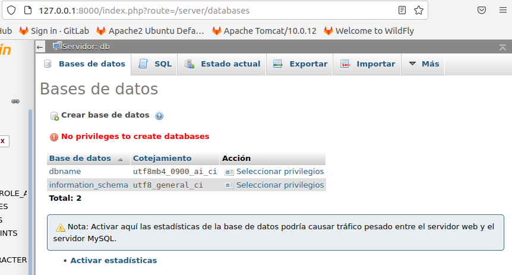

## **8. Parte 8**

Ejecutamos de nuevo **“docker-compose down –volume”** para apagar y borrar los contenedores

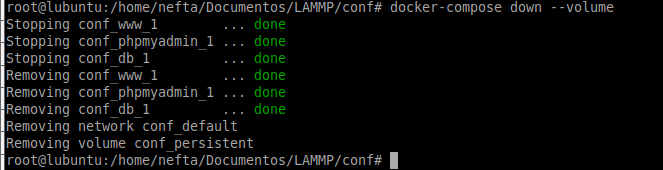

Cogemos un archivo PHP nuestro y lo intercambiamos por el que creamos de inicio.

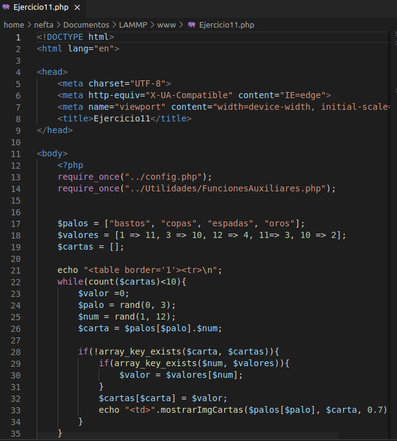

Volveremos a ejecutar **“docker-compose up -d”** para crear de nuevo los contenedores. Una vez arrancados abrimos el navegador y escribimos **“localhost”** y deberemos ver el php que hemos puesto en el paso anterior. En nuestro marca errores ya que el archivo que colocamos depende de otro archivo php.

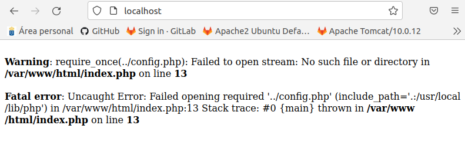
