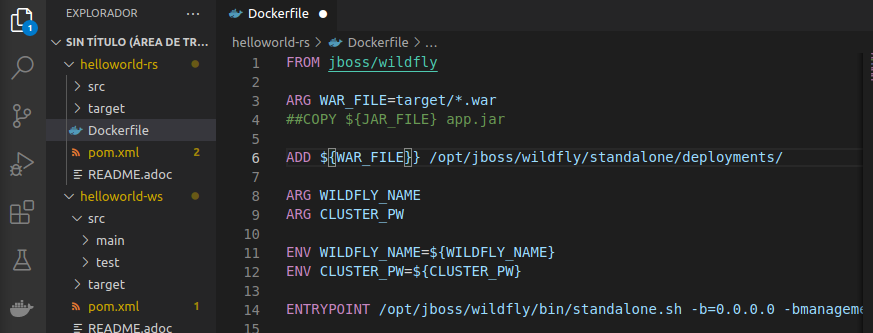
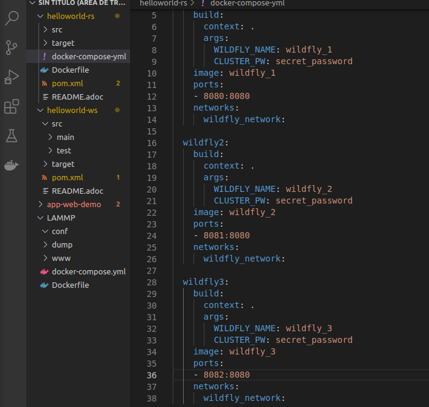
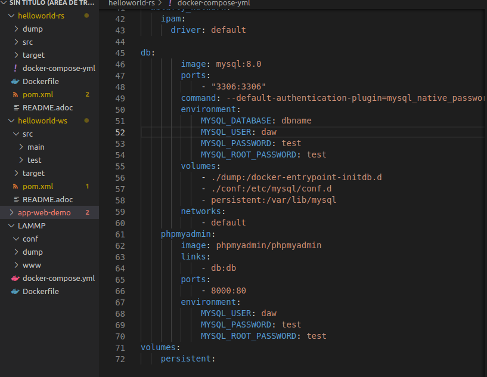
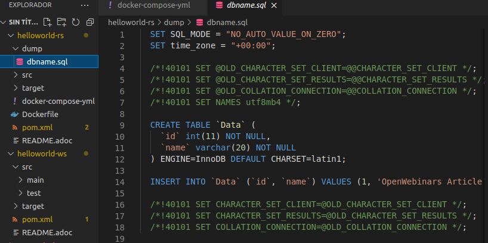
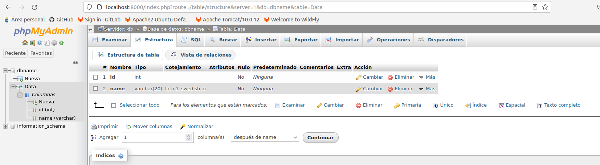
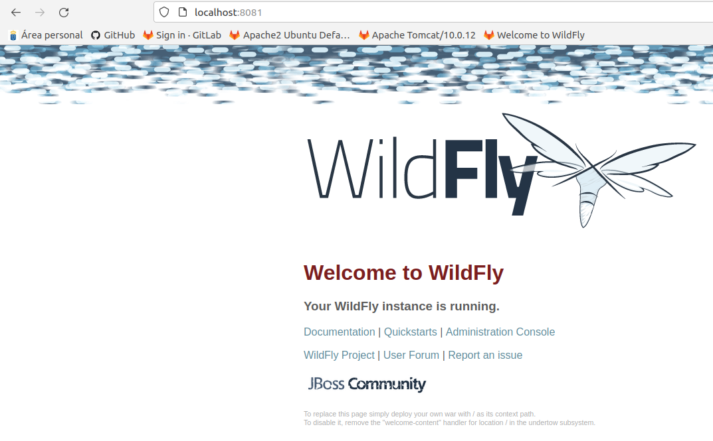
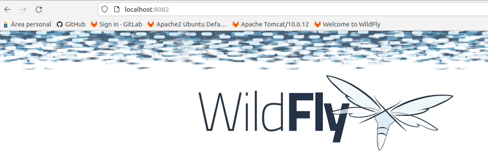
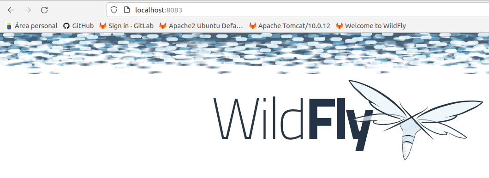
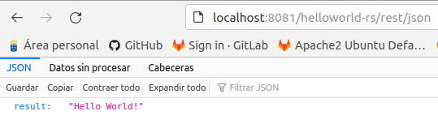
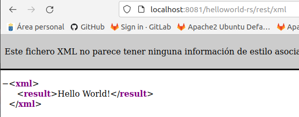

# **Clusterizando un Servicio Rest en Wildfly**

**Neftalí Rodríguez Rodríguez**

[**Github**](https://github.com/InKu3uS/)

**Indice**

[Clusterizando un Servicio Rest en Wildfly](#id1)

[1. Primera parte](#id1)

[2. Segunda parte](#id2)

[3. Tercera parte](#id3)

[4. Cuarta parte](#id4)

[5. Quinta parte](#id5)

[6. Sexta parte](#id6)

## **1. Primera parte**

Descargamos el servicio “helloworld-rs”. En la raiz del proyecto creamos el archivo Dockerfile con el siguiente contenido.

## **2. Segunda parte**

En el mismo directorio creamos el archivo “docker-compose.yml” que contendra la información de todos los contenedores que vamos a crear y los puertos bajo los que van a funcionar.

## **3. Tercera parte**

A continuación, en el directorio “dump” del proyecto, crearemos el archivo “dbname.sql” que creará la base de datos contenida en el archivo en el contenedor de PHPMyAdmin.

Cuando hayamos completado los pasos anteriores, abriremos una terminal y pondremos el comando “mvn clean install” para compilar el proyecto y se cree el archivo “.war” que se desplegará en los 3 contenedores Wildfly.

Una vez termine de compilar el proyecto ejecutaremos el comando “sudo docker-compose up -d –buid” para crear los contenedores y arrancarlos.

## **4. Cuarta parte**

Una vez que hayan arrancado los contenedores, abrimos un navegador e introducimos la URL “localhost:8000”. El puerto 8000 se ha asignado a PHPMyAdmin. Tras loguearnos veremos el panel de control de PHPMyAdmin y veremos como la base de datos se ha creado con éxito.

## **5. Quinta parte**

Ahora probaremos los contenedores Wildfly, a los que les corresponden los puertos “8081-8082 y 8083”

## **6. Sexta parte**

Por ultimo, introducimos “localhost:puerto del contenedor/helloworld-rs/” para probar que el servicio se ha desplegado correctamente.

