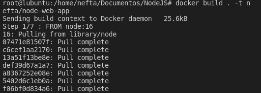

## **NodeJS con Docker**

**Neftalí Rodríguez Rodríguez**

[**Github**](https://github.com/InKu3uS/)

**Indice**

[NodeJS con Docker](#id1)

[1. Primera parte](#id1)

[2. Segunda parte](#id2)

[3. Tercera parte](#id3)

[4. Cuarta parte](#id4)

[5. Quinta parte](#id5)

## **1. Primera parte**

Creamos un nuevo proyecto y en su interior creamos el archivo **“package.json”** con el contenido que aparece a continuación.

Si intentamos ejecutar el comando **“npm install”** nos daremos cuenta de que npm no se encuentra instalado, asi que lo instalamos mediante **“apt npm install”**.

Una vez completada la instalación ejecutamos el comando **“npm install”**

Al acabar debería mostrar una salida similar a esta

Se deberá haber creado el siguiente archivo **“package-lock.json”**

## **2. Segunda parte**

Una vez completado el paso anterior, creamos el archivo **“server.js”** con el contenido que se muestra en la siguiente imagen

## **3. Tercera parte**

A continuación creamos el archivo **“Dockerfile”**

Y el archivo **“.dockerignore”**

## **4. Cuarta parte**

Luego abrimos una terminal dentro del directorio del proyecto y ejecutamos el comando **“docker build . t ‘etiqueta del contenedor’/nodeweb-app”** y esperamos a que se descargue y se cree el contenedor

## **5. Quinta parte**

Por ultimo, lanzamos el contenedor con el comando **“docker run p ‘puerto’:8080 ‘etiqueta del contenedor’/node-web-app”**

Abrimos un navegador y en la URL introducimos **“0.0.0.0:5555”** y comprobamos que vemos el mensaje **“Hello World”**

