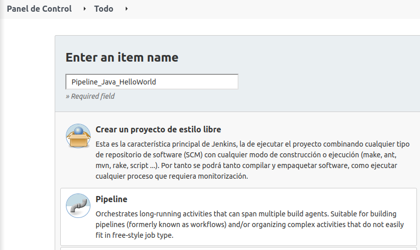
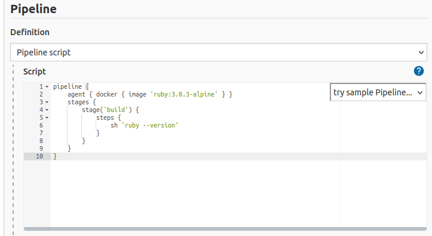
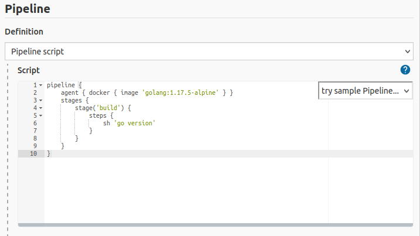

## **Pipelines en Jenkins**

**Neftalí Rodríguez Rodríguez**

[**Github**](https://github.com/InKu3uS/)

Indice

[Pipelines en Jenkins](#id1)

[2. Parte 1](#id1)

[2. Parte 2](#id2)

[3. Parte 3](#id3)

[4. Parte 4](#id4)

[5. Parte 5](#id5)

[6. Parte 6](#id6)

[7. Parte 7](#id7)

[8. Parte 8](#id8)

## **2. Parte 1**

Antes de empezar a crear nuevas tareas en Jenkins nos aseguraremos de tener los plugins necesarios instalados. Para ello nos dirigiremos a **“Administrar Jenkins”**, luego a **“Administrar plugins”** y en dicha pantalla buscaremos **“docker”** en el cuadro de busqueda. Necesitaremos los plugins **“docker plugin”** y **“docker pipeline”**. Marcamos ambos y pulsamos en instalar.

Marcaremos la opcion de que se reinicie Jenkins al acabar la instalación y esperamos a que se instalen los plugins

## **2. Parte 2**

Accedemos al panel de control de Jenkins y pulsamos sobre **“Nueva tarea”**. Nos llevará a la siguiente pantalla en la que le pondremos un nombre a la tarea y luego pulsamos sobre la opcion **“Pipeline”**

En la siguiente ventana que nos aparecerá a continuación, nos desplazamos al final de esta y pegamos el script que vamos a usar dentro del cuadro de texto “Pipeline script”

Una vez se haya creado la tarea pulsamos sobre **“Construir ahora”** y esperamos a que se ejecute la tarea.

Si la tarea se ha ejecutado con éxito, debemos ver una pantalla como la siguiente.

Si miramos la salida de la tarea, veremos la versión de que se ha ejecutado el comando **“mvn –version”** y se muestra la salida correctamente.

**3. Parte 3**

Creamos otra nueva tarea Pipeline, esta vez para **NodeJS**. Tal y como lo hicimos en el paso anterior pero cambiaremos el script por uno que descargue un **contenedor Docker de NodeJS** y ejecute el comando **“node –version”**.

Seguimos completando la tarea y esperamos a que se ejecute, si se ejecuta correctamente deberá mostrar la versión de **NodeJS** del contenedor.

## **4. Parte 4**

Repetimos el proceso, esta vez para un contenedor Docker de **Ruby**

Al ejecutarse la tarea correctamente, nos mostrará la versión de **Ruby** del contenedor.

## **5. Parte 5**

Crearemos otro Pipeline para un contenedor Docker de **Python** mediante el script que se muestra en la imagen.

Al finalizar la tarea nos mostrará la versión de **Python** del contenedor.

## **6. Parte 6**

Esta vez haremos lo mismo para un contenedor de **PHP** usando el siguiente scrtipt

Al finalizar podremos ver que se nos muestra la versión de **PHP** del contenedor.

## **7. Parte 7**

Por último, crearemos otro Pipeline para un contenedor **Go** usando el siguiente script

Al completarse la tarea, veremos la versión de **Go** del contenedor Docker.

## **8. Parte 8**

Si todas las tareas se han ejecutado con éxito, la pagina principal de Jenkins debería mostrarse de una manera similar a esta. Donde vemos con el tick verde que la ultima ejecución de los contenedores fue exitosa, el sol indica que las dos últimas ejecuciones no produjeron errores, el tiempo que ha pasado desde la última ejecución exitosa de la tarea, el último fallo (N/D en nuestro caso ya que ninguno falló), y la duración de la última ejecución.

